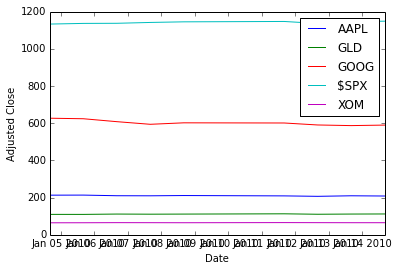
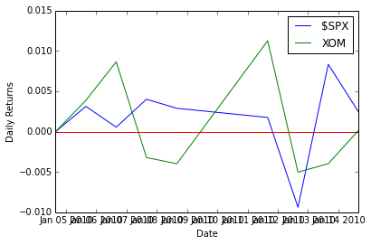
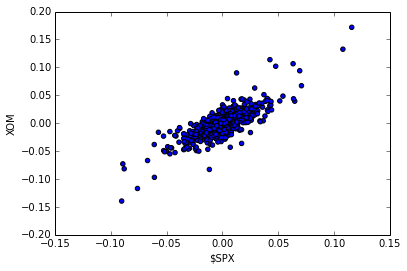
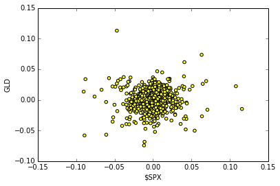
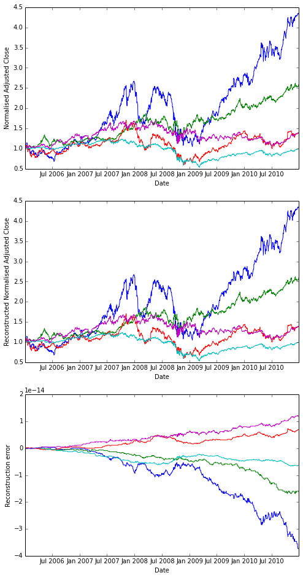
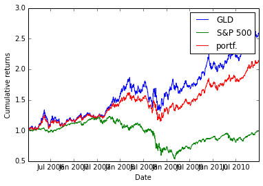
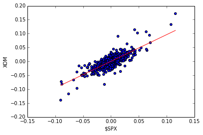

# Week 3: NumPy, QSTK/Pandas Demo, Homework 1 and Interview with Tom Sosnoff

## NumPy tutorial
[(read the tutorial script)](http://wiki.quantsoftware.org/index.php?title=Numpy_Tutorial_1)

### Many ways

There are many ways to go through a programming tutorial. My two
favourite ways to read a Python tutorial are

* to open the tutorial script in emacs in python-mode. There are [nice
extensions](http://github.com/gabrielelanaro/emacs-for-python) worth using, or
* to go through the tutorial by copy-pasting it in [an IPython Notebook](http://ipython.org/ipython-doc/stable/interactive/notebook.html)

To run IPython and copy-paste things in it, you don't need to change
directory, but in case you may want to run a script
(```execfile('script.py')```), import something local to that
directory (```import mylibrary as mlib```) or output
something, it's better to be in the right place from the start.

<div class="highlight"><pre><code>cd dev/coursera-comp-invest-1/Examples/Basic</code></pre></div>

Activate the virtualenv (you create it with ```mkvirtualenv somename```, deactivate it with ```deactivate```, and read the doc for more), start the IPython notebook server

<div class="highlight"><pre><code>workon somename
ipython notebook</code></pre></div>

The rest of this section is copied from the Quantsoftware
wiki-based [NumPy
tutorial](http://wiki.quantsoftware.org/index.php?title=Numpy_Tutorial_1),
with a few additional comments of my own.

As an alternative, if you want to see the Python interpreter
output without running the tutorial, you can 

* [read it as a formatted IPython
notebook](quantsoftware_numpy_tutorial.html), or
* [read the same IPython Notebook on
  nbviewer](http://nbviewer.ipython.org/urls/raw.github.com/agravier/agravier.github.io/master/etc/notes/ci1-coursera/quantsoftware_numpy_tutorial.ipynb), or
* [download the
notebook](https://raw.github.com/agravier/agravier.github.io/master/etc/notes/ci1-coursera/quantsoftware_numpy_tutorial.ipynb)
for your own usage.

### Importing Numpy
[(watch section)](https://class.coursera.org/compinvesting1-003/lecture/view?lecture_id=147)  

The following loads the numpy library and lets us refer to it by the shorthand "np",
which is the convention used in the numpy documentation and in many
online tutorials/examples.

import numpy as np


### Creating arrays 

Now lets make an array to play around with. You can make numpy arrays
in a number of ways, filled with zeros. Here, the argument ```(2,3)```
is of basic type ```tuple```.


zeroArray = np.zeros( (2,3) ) # [[ 0.  0.  0.]
print zeroArray               #  [ 0.  0.  0.]]


Or ones:

oneArray = np.ones( (2,3) )   # [[ 1.  1.  1.]
print oneArray                #  [ 1.  1.  1.]]


Or filled with junk:

emptyArray = np.empty( (2,3) ) 
print emptyArray


Note, emptyArray might look random, but it's just uninitialised which means
you shouldn't count on it having any particular data in it, even random
data! If you do want random data you can use random():

randomArray = np.random.random( (2,3) )
print randomArray


If you're following along and trying these commands out, you should have
noticed that making randomArray took a lot longer than emptyArray. That's
because np.random.random(...) is actually using a random number generator
to fill in each of the spots in the array with a randomly sampled number
from 0 to 1.

You can also create an array by hand:

foo = [ [1,2,3],
        [4,5,6]]
myArray = np.array(foo) # [[1 2 3] 
print myArray           #  [4 5 6]]


### Reshaping arrays
Of course, if you're typing out a range for a larger matrix, it's easier to
use arange(...):

rangeArray = np.arange(6,12).reshape( (2,3) ) # [[ 6  7  8]
print rangeArray                              #  [ 9 10 11]]


there's two things going on here. First, the arange(...) function returns a
1D array similar to what you'd get from using the built-in python function
range(...) with the same arguments, except it returns a numpy array
instead of a list.

print np.arange(6,12) # [ 6  7  8  9 10 11 12]


the reshape method takes the data in an existing array, and stuffs it into
an array with the given shape and returns it.  

print rangeArray.reshape( (3,2) ) # [[ 6  7]
                                  #  [ 8  9]
                                  #  [10 11]]


The original array doesn't change though.

print rangeArray # [[ 6  7  8]
                 #  [ 9 10 11]


[(watch section)](https://class.coursera.org/compinvesting1-003/lecture/view?lecture_id=149)

When you use reshape(...) the total number of things in the array must stay
the same. So reshaping an array with 2 rows and 3 columns into one with 
3 rows and 2 columns is fine, but 3x3 or 1x5 won't work

# print rangeArray.reshape( (3,3) ) #ERROR
squareArray = np.arange(1,10).reshape( (3,3) ) #this is fine, 9 elements


### Accessing array elements

Accessing an array is also pretty straight forward. You access a specific
spot in the table by referring to its row and column inside square braces
after the array:

print rangeArray[0,1] #7


Note that row and column numbers start from 0, not 1! Numpy also lets you 
refer to ranges inside an array (note that the lower bound is
included, and the upper bound is excluded):

print rangeArray[0,0:2] #[6 7]
print squareArray[0:2,0:2] #[[1 2]  # the top left corner of squareArray
                           # [4 5]]


These ranges work just like slices and python lists. n:m:t specifies a range
that starts at n, and stops before m, in steps of size t. If any of these 
are left off, they're assumed to be the start, the end+1, and 1 respectively

print squareArray[:,0:3:2] #[[1 3]   #skip the middle column
                           # [4 6]
                           # [7 9]]


Also like python lists, you can assign values to specific positions, or
ranges of values to slices

squareArray[0,:] = np.array(range(1,4)) #set the first row to 1,2,3
squareArray[1,1] = 0                    # set the middle spot to zero
squareArray[2,:] = 1                    # set the last row to ones
print squareArray                       # [[1 2 3]
                                        #  [4 0 6]
                                        #  [1 1 1]]


Something new to numpy arrays is indexing using an array of indices:

fibIndices = np.array( [1, 1, 2, 3] )
randomRow = np.random.random( (10,1) ) # an array of 10 random numbers
print randomRow
print randomRow[fibIndices] # the first, first, second and third element of
                             # randomRow 


You can also use an array of true/false values to index:

boolIndices = np.array( [[ True, False,  True],
                          [False,  True, False],
                          [ True, False,  True]] )
print squareArray[boolIndices] # a 1D array with the selected values
                                # [1 3 0 1 1]


It gets a little more complicated with 2D (and higher) arrays.  You need
two index arrays for a 2D array:

rows = np.array( [[0,0],[2,2]] ) #get the corners of our square array
cols = np.array( [[0,2],[0,2]] )
print squareArray[rows,cols]     #[[1 3]
                                 # [1 1]]
boolRows = np.array( [False, True, False] ) # just the middle row
boolCols = np.array( [True, False, True] )  # Not the middle column
print squareArray[boolRows,boolCols]        # [4 6]


### Operations on arrays

One useful trick is to create a boolean matrix based on some test and use
that as an index in order to get the elements of a matrix that pass the
test:

sqAverage = np.average(squareArray) # average(...) returns the average of all
                                    # the elements in the given array
betterThanAverage = squareArray > sqAverage
print betterThanAverage             #[[False False  True]
                                    # [ True False  True]
                                    # [False False False]]
print squareArray[betterThanAverage] #[3 4 6]


[(watch
section)](https://class.coursera.org/compinvesting1-003/lecture/view?lecture_id=151)
(beware, the video follows another version of the tutorial, and
squareArray is different)

Note that a python assignment ```b = a``` from an ***object*** named
_a_ to another name _b_ only copies the reference to the object, so
mutating the original _a_ results in those changes being reflected
through _b_. To get a copy, objects assignment is not enough, a copy
must be made too: ```b = a.copy()```. That remark is also valid for numpy
arrays.

Indexing like this can also be used to assign values to elements of the
array. This is particularly useful if you want to filter an array, say by 
making sure that all of its values are above/below a certain threshold:

sqStdDev = np.std(squareArray) # std(...) returns the standard deviation of
                               # all the elements in the given array
clampedSqArray = np.array(squareArray.copy(), dtype=float) 
                                    # make a copy of squareArray that will
                                    # be "clamped". It will only contain
                                    # values within one standard deviation
                                    # of the mean. Values that are too low
                                    # or to high will be set to the min
                                    # and max respectively. We set 
                                    # dtype=float because sqAverage
                                    # and sqStdDev are floating point
                                    # numbers, and we don't want to 
                                    # truncate them down to integers.
clampedSqArray[ (squareArray-sqAverage) > sqStdDev ] = sqAverage+sqStdDev
clampedSqArray[ (squareArray-sqAverage) < -sqStdDev ] = sqAverage-sqStdDev
print clampedSqArray # [[ 1.          2.          3.        ]
                     #  [ 3.90272394  0.31949828  3.90272394]
                     #  [ 1.          1.          1.        ]]



Multiplying and dividing arrays by numbers does what you'd expect. It
multiples/divides element-wise

print squareArray * 2 # [[ 2  4  6]
                      #  [ 8  0 12]
                      #  [ 2  2  2]]


Addition works similarly:

print squareArray + np.ones( (3,3) ) #[[2 3 4]
                                     # [5 1 7]
                                     # [2 2 2]]


Multiplying two arrays together (of the same size) is also element wise

print squareArray * np.arange(1,10).reshape( (3,3) ) #[[ 1  4  9]
                                                     # [16  0 36]
                                                     # [ 7  8  9]]


Unless you use the dot(...) function, which does matrix multiplication
from linear algebra:

matA = np.array( [[1,2],[3,4]] )
matB = np.array( [[5,6],[7,8]] )
print np.dot(matA,matB) #[[19 22]
                        # [43 50]]


And that's it! There's a lot more to the numpy library, and there are a few
things I skipped over here, such as what happens when array dimensions
don't line up when you're indexing or multiplying them together, so if 
you're interested, I strongly suggest you head over to the [scipy wiki's
numpy tutorial](http://www.scipy.org/Tentative_NumPy_Tutorial) for a more in depth look at using numpy arrays.


## QSTK Demo

[(watch section)](https://class.coursera.org/compinvesting1-003/lecture/view?lecture_id=163)  
[(read the wiki)](http://wiki.quantsoftware.org/index.php?title=QSTK_Tutorial_1)

The following is the output of an IPython notebook.

* [download the
notebook](https://raw.github.com/agravier/agravier.github.io/master/etc/notes/ci1-coursera/qstk_tutorial_1.ipynb))
* [read it on
  nbviewer](http://nbviewer.ipython.org/urls/raw.github.com/agravier/agravier.github.io/master/etc/notes/ci1-coursera/qstk_tutorial_1.ipynb)

### Imports

* numpy, pylab and matplotlib provide a number of functions to Python that give
it MATLAB-like capabilities.
* datetime helps us manipulate dates.
* The qstkutil items are from the QuantSoftware ToolKit


 ```Input:```

import QSTK.qstkutil.qsdateutil as du
import QSTK.qstkutil.tsutil as tsu
import QSTK.qstkutil.DataAccess as da

import datetime as dt
import matplotlib.pyplot as plt
import pandas as pd


Some notebook magic, please ignore


 ```Input:```

%matplotlib inline


### Some symbols and dates

We'll be using historical adjusted close data. QSTK has a DataAccess class
designed to quickly read this data into pandas DataFrame object. We must first
select which symbols we're interested in, and for which time periods. Note that
the wiki tutorial script uses 2006, but in the video tutorial, we use 2010. The
end date differs too, so as we have 2 weeks of data. SPX is the S&P 500.


 ```Input:```

ls_symbols = ["AAPL", "GLD", "GOOG", "$SPX", "XOM"]
dt_start = dt.datetime(2010, 1, 1)
dt_end = dt.datetime(2010, 1, 15)


The time at which the market closes is 16:00.


 ```Input:```

dt_timeofday = dt.timedelta(hours=16)


The function ```getNYSEdays(dt_start, dt_end, dt_timeofday)``` returns the days
of the interval for which the New York stock exchange was open. It adds the
time of day given as param to each datetime member of the result list.


 ```Input:```

ldt_timestamps = du.getNYSEdays(dt_start, dt_end, dt_timeofday)



 ```Input:```

ldt_timestamps



```Output:```
    [Timestamp('2010-01-04 16:00:00', tz=None),
     Timestamp('2010-01-05 16:00:00', tz=None),
     Timestamp('2010-01-06 16:00:00', tz=None),
     Timestamp('2010-01-07 16:00:00', tz=None),
     Timestamp('2010-01-08 16:00:00', tz=None),
     Timestamp('2010-01-11 16:00:00', tz=None),
     Timestamp('2010-01-12 16:00:00', tz=None),
     Timestamp('2010-01-13 16:00:00', tz=None),
     Timestamp('2010-01-14 16:00:00', tz=None)]


Note than Jan 4 was the first open day of the interval, and Jan 14, the last.

### Data access

Create an object that will be ready to read from our Yahoo data source


 ```Input:```

c_dataobj = da.DataAccess('Yahoo')


```c_dataobj.get_data``` creates a list of DataFrame objects. The dict-zipping
converts this list into a dictionary for easier access.


 ```Input:```

ls_keys = ['open', 'high', 'low', 'close', 'volume', 'actual_close']
ldf_data = c_dataobj.get_data(ldt_timestamps, ls_symbols, ls_keys)
d_data = dict(zip(ls_keys, ldf_data))


Note that in the list of keys, ```'close'``` refers to adjusted close, and
actual_close is the raw close price. Looking at the type of the object created
by get_data


 ```Input:```

ldf_data.__class__, ldf_data[1].__class__



```Output:```
    (list, pandas.core.frame.DataFrame)


 ```Input:```

d_data['close']



```Output:```
<div style="max-height:1000px;max-width:1500px;overflow:auto;">
<table border="1" class="dataframe">
  <thead>
    <tr style="text-align: right;">
      <th></th>
      <th>AAPL</th>
      <th>GLD</th>
      <th>GOOG</th>
      <th>$SPX</th>
      <th>XOM</th>
    </tr>
  </thead>
  <tbody>
    <tr>
      <th>2010-01-04 16:00:00</th>
      <td> 213.10</td>
      <td> 109.80</td>
      <td> 626.75</td>
      <td> 1132.99</td>
      <td> 64.55</td>
    </tr>
    <tr>
      <th>2010-01-05 16:00:00</th>
      <td> 213.46</td>
      <td> 109.70</td>
      <td> 623.99</td>
      <td> 1136.52</td>
      <td> 64.80</td>
    </tr>
    <tr>
      <th>2010-01-06 16:00:00</th>
      <td> 210.07</td>
      <td> 111.51</td>
      <td> 608.26</td>
      <td> 1137.14</td>
      <td> 65.36</td>
    </tr>
    <tr>
      <th>2010-01-07 16:00:00</th>
      <td> 209.68</td>
      <td> 110.82</td>
      <td> 594.10</td>
      <td> 1141.69</td>
      <td> 65.15</td>
    </tr>
    <tr>
      <th>2010-01-08 16:00:00</th>
      <td> 211.07</td>
      <td> 111.37</td>
      <td> 602.02</td>
      <td> 1144.98</td>
      <td> 64.89</td>
    </tr>
    <tr>
      <th>2010-01-11 16:00:00</th>
      <td> 209.21</td>
      <td> 112.85</td>
      <td> 601.11</td>
      <td> 1146.98</td>
      <td> 65.62</td>
    </tr>
    <tr>
      <th>2010-01-12 16:00:00</th>
      <td> 206.83</td>
      <td> 110.49</td>
      <td> 590.48</td>
      <td> 1136.22</td>
      <td> 65.29</td>
    </tr>
    <tr>
      <th>2010-01-13 16:00:00</th>
      <td> 209.75</td>
      <td> 111.54</td>
      <td> 587.09</td>
      <td> 1145.68</td>
      <td> 65.03</td>
    </tr>
    <tr>
      <th>2010-01-14 16:00:00</th>
      <td> 208.53</td>
      <td> 112.03</td>
      <td> 589.85</td>
      <td> 1148.46</td>
      <td> 65.04</td>
    </tr>
  </tbody>
</table>
</div>


### Drawing a figure

We pull the close prices we cant to plot out of the pandas DataFrame, into a 2D
numpy array.


 ```Input:```

na_price = d_data['close'].values


Now, plotting with matplotlib. Here we first clear the plot (```clf```), plot
the data, and then modify the plot to add a legend and some labels.


 ```Input:```

plt.clf()
plt.plot(ldt_timestamps, na_price)
plt.legend(ls_symbols)
plt.ylabel('Adjusted Close')
plt.xlabel('Date')



```Output:```
    <matplotlib.text.Text at 0x4a9c2d0>





To save a PDF file containing the plot:


 ```Input:```

plt.savefig('adjustedclose.pdf', format='pdf')



```Output:```
    <matplotlib.figure.Figure at 0x4923310>


### Data normalisation
[(watch section)](https://class.coursera.org/compinvesting1-003/lecture/view?lecture_id=165)

To better see the variations, we normalise the data with respect to the first
day's price (so we divide all rows by the first row).


 ```Input:```

na_normalized_price = na_price / na_price[0, :]


Plotting:


 ```Input:```

plt.clf()
plt.plot(ldt_timestamps, na_normalized_price)
plt.legend(ls_symbols)
plt.ylabel('Normalised Adjusted Close')
plt.xlabel('Date')



```Output:```
    <matplotlib.text.Text at 0x4d04110>


### Daily returns
**(From here, there are no video tutorials, only the wiki)**

The QSTK function ```returnize0``` computes the daily return of stocks
(remember, \\(\text{ret}(t) = \frac{\text{price}(t)}{\text{price}(t-1)} -1\\)).
Beware, ```returnize0``` mutates the array. Make a copy first:


 ```Input:```

na_rets = na_normalized_price.copy()
tsu.returnize0(na_rets)



```Output:```
    array([[ 0.        ,  0.        ,  0.        ,  0.        ,  0.        ],
           [ 0.00168935, -0.00091075, -0.00440367,  0.00311565,  0.00387297],
           [-0.0158812 ,  0.01649954, -0.02520874,  0.00054552,  0.00864198],
           [-0.00185652, -0.00618779, -0.02327952,  0.00400127, -0.00321297],
           [ 0.00662915,  0.004963  ,  0.01333109,  0.00288169, -0.00399079],
           [-0.00881224,  0.01328904, -0.00151158,  0.00174676,  0.01124981],
           [-0.01137613, -0.02091272, -0.01768395, -0.00938116, -0.00502895],
           [ 0.01411787,  0.00950312, -0.00574109,  0.00832585, -0.00398223],
           [-0.00581645,  0.00439304,  0.00470115,  0.00242651,  0.00015378]])


 ```Input:```

plt.clf()
plt.plot(ldt_timestamps[0:50], na_rets[0:50, 3])  # $SPX 50 days
plt.plot(ldt_timestamps[0:50], na_rets[0:50, 4])  # XOM 50 days
plt.axhline(y=0, color='r')
plt.legend(['$SPX', 'XOM'])
plt.ylabel('Daily Returns')
plt.xlabel('Date')



```Output:```
    <matplotlib.text.Text at 0x4923a90>





### Scatter plots

To estimate the correlation between two securities. Let's work with more data
first.


 ```Input:```

dt_start = dt.datetime(2006, 1, 1)
dt_end = dt.datetime(2010, 12, 31)
ldt_timestamps = du.getNYSEdays(dt_start, dt_end, dt_timeofday)
d_data = dict(zip(ls_keys, c_dataobj.get_data(ldt_timestamps, ls_symbols, ls_keys)))


Filling the data for NAN: we apply the filling functions in decreasing order of
preference.


 ```Input:```

for s_key in ls_keys:
    d_data[s_key] = d_data[s_key].fillna(method='ffill')
    d_data[s_key] = d_data[s_key].fillna(method='bfill')
    d_data[s_key] = d_data[s_key].fillna(1.0)


Getting the numpy ndarray of close prices.


 ```Input:```

na_price = d_data['close'].values
na_normalized_price = na_price / na_price[0, :]
na_rets = na_normalized_price.copy()
tsu.returnize0(na_rets);


XOM vs. S&P 500:


 ```Input:```

plt.clf()
plt.scatter(na_rets[:, 3], na_rets[:, 4], c='blue')
plt.ylabel('XOM')
plt.xlabel('$SPX')



```Output:```
    <matplotlib.text.Text at 0x4fe8850>





Plotting the scatter plot of daily returns between $SPX VS GLD


 ```Input:```

plt.clf()
plt.scatter(na_rets[:, 3], na_rets[:, 1], c='yellow')
plt.ylabel('GLD')
plt.xlabel('$SPX')



```Output:```
    <matplotlib.text.Text at 0x5003f50>





## QSTK Exercises

### Exercise: Cumulative Daily Returns

Using the daily returns we can reconstruct cumulative daily returns. Note that
in general the cumulative daily return for day t is defined as follows (this is
NOT Python code, it is an equation):

 ```Input:```

daily_cum_ret(t) = daily_cum_ret(t-1) * (1 + daily_ret(t))


I don't provide the code for this, as it is a programming assignment. If you
plot the result, it should look exactly like the normalized returns plot above.

#### Answer


 ```Input:```

import numpy as np

def daily_cum_ret(np_arr):
    "Reconstructs the cumulative returns from daily returns."
    assert np_arr.size != 0
    dcr = np.empty_like(np_arr, dtype=float)
    dcr[0] = 1
    for ri in xrange(1, np_arr.shape[0]):
        dcr[ri] = dcr[ri-1] * (1+np_arr[ri])
    return dcr

# For comparison
plt.clf()
plt.figure(figsize=(8,16))
plt.subplot(311)
plt.plot(ldt_timestamps, na_normalized_price)
plt.ylabel('Normalised Adjusted Close')
plt.xlabel('Date')

# Our reconstruction
plt.subplot(312)
plt.plot(ldt_timestamps, daily_cum_ret(na_rets))
plt.ylabel('Reconstructed Normalised Adjusted Close')
plt.xlabel('Date')

# floating point operations cumulative error
err = na_normalized_price - daily_cum_ret(na_rets)
plt.subplot(313)
plt.plot(ldt_timestamps, err)
plt.ylabel('Reconstruction error')
plt.xlabel('Date')



```Output:```
    <matplotlib.text.Text at 0x5824790>


```Output:```
    <matplotlib.figure.Figure at 0x564f190>





### Exercise: Combining Daily Returns To Estimate Portfolio Returns

Suppose we want to estimate the performance of a portfolio composed of 75% GLD
and 25% SPY? We can approximate the daily returns in an equation as follows:

    portfolio_daily_rets = 0.75 * GLD_daily_rets + 0.25 * SPY_daily_rets

Then, using the equation above for cumulative daily returns, we can plot the
performance of the combined portfolio. This also is an assignment in my course,
so I don't list the code for it here.

#### Answer

As I am lazy, I approximate \\(\text{SPX} \approx \text{SPY}\\)


 ```Input:```

p_rets = na_rets[:, 3] * 0.25 + na_rets[:, 1] * 0.75
na_plot_cumul_rets = daily_cum_ret(np.concatenate([na_rets[:, [1, 3]], p_rets[:, np.newaxis]], axis=1))

plt.clf()
plt.plot(ldt_timestamps, na_plot_cumul_rets)
plt.legend(["GLD", "S&P 500", "portf."])
plt.ylabel('Cumulative returns')
plt.xlabel('Date')



```Output:```
    <matplotlib.text.Text at 0x5c08350>





### Exercise: Line fit to Daily Returns

Finally, we revisit the scatter plots above that reveal visually how closely
correlated (related) the daily movement of two stocks are. It's even better if
can quantify this correlation by fitting a line to them using linear regression.
Note the red line in the figure on the right; this was computed using one of
NumPy's linear regression tools. The value of the slope of the line is reported
as "corr" which is technically not correct.

Wikipedia has [a nice
discussion](http://en.wikipedia.org/wiki/Correlation_and_dependence) of
correlation.

Again, I'm not going to show the code here, but I will tell you that the code is
not very complex, and I used the following functions: polyfit(), polyval(), and
sort().

#### Answer

Note that there is no figure on the wiki. So I choose to fit the XOM
scatter plot. I also don't use the same functions as the instructor, but my
version works too.


 ```Input:```

spx_rets, xom_rets = na_rets[:, 3], na_rets[:, 4]
coefs = np.polyfit(x=spx_rets, y=xom_rets, deg=1)
fit_f = np.poly1d(coefs)
fit_x = [np.amin(spx_rets), np.amax(spx_rets)]
fit_y = fit_f(fit_x)

plt.clf()
plt.scatter(spx_rets, xom_rets, c='blue')
plt.plot(fit_x, fit_y, c='red')
plt.ylabel('XOM')
plt.xlabel('$SPX')



```Output:```
    <matplotlib.text.Text at 0x5e701d0>





## Homework 1: building, assessing and optimising a portfolio

[(watch section)](https://class.coursera.org/compinvesting1-003/lecture/view?lecture_id=157)

### Overview
#### About part 1

Given 4 equity symbols and a start date and end date spanning one year, we want to answer the question: what would have been the optimal allocation for the portfolios in the beginning of the year to maximise the Sharpe ratio?

The required knowledge is in QSTK tutorials [1](http://wiki.quantsoftware.org/index.php?title=QSTK_Tutorial_1) and [3](http://wiki.quantsoftware.org/index.php?title=QSTK_Tutorial_3). 

Note that the code used to combine individual equities' performances to get the overall portfolio performance does **not** apply to the assignment. Tutorial 3 re-balances the portfolio everyday to keep the initial weighting, but the homework wants you to assign once in the beginning of the year and that's all.

#### About part 2

Write a ```simulate``` function which, given as parameters

* start date (datetime object)
* end date (datetime object)
* a list of equity symbols 
* a list of corresponding allocations summing up to 1

simulates the initial investment as the start date as defined in the list of allocations, and calculates the cumulative daily returns and all other necessary data to get, as a 4-tuple output:

* stdev of daily returns of the overall portfolio
* average daily return of the overall portfolio
* Sharpe ratio of the portfolio
* cumulative return of the portfolio

Example output:


    Start Date: January 1, 2010
    End Date: December 31, 2010
    Symbols: ['AXP', 'HPQ', 'IBM', 'HNZ']
    Optimal Allocations:  [0.0, 0.0, 0.0, 1.0]
    Sharpe Ratio: 1.29889334008
    Volatility (stdev of daily returns): 0.00924299255937
    Average Daily Return: 0.000756285585593
    Cumulative Return: 1.1960583568


To verify that the function works well, see the wiki's [example outputs](http://wiki.quantsoftware.org/index.php?title=CompInvestI_Homework_1#Example_output)

#### About part 3

Use the simulate function to optimise portfolios. This portfolio optimiser will probably test many portfolios allocations and select the best one.

A brute force search with nested for loops is manageable in 10% increments of allocation. Remember to only consider portfolios with weights adding up to 1.

#### About part 4 (not to be submitted)

Plot stuff and be happy! (That advice may or may not apply to all aspects of life)

### More details
[(watch section)](https://class.coursera.org/compinvesting1-003/lecture/view?lecture_id=159)

Create a function that can assess a portfolio given 4 equities bought at the beginning of the period and held all along.

The video shows how to use spreadsheet software to perform the portfolio performance calculation. In 2011, 252 adjusted closing price (1 per trading days). In Python, for each equity, 

* store those in a Pandas DataFrame,
* create a new DataFrame with normalised prices (divide all prices by the first day's price)
* in the homework, we don't speak about dollars but just ratios, it's like investing a total of $1
* calculate each investment's and the portfolio's cumulative returns
* from that portfolio's cumulative return, calculate the portfolio's daily returns
* From there, compute the necessary statistics

## Interview with Tom Sosnoff

[(watch section)](https://class.coursera.org/compinvesting1-003/lecture/view?lecture_id=145)

Tom was Market Maker, is now a trader, has influenced brokerage, CS, and trading. 

Tastytrade is Tom's "vision of alternative financial content", creating a financial network focused on derivatives and an alternative strategic approach to investing. They want to better serve the individual investors. Bring the true power of self-directed investing to consumers. Self-directed investing is independent individual investing driven by logic.

TB: What was it like before computers prevailed in markets? How did human orders get processed?

TS: was a trader at the Chicago Board Options Exchange from 1980 to 2000. Had a proprietary trading firm on the floor there. Was both MM and traded their own capital. The customer wants to make an order, they reach their broker by phone (in the 1980s) or by some electronic system (in the 1990s). The broker then contacted the trader either by some wire service or on the phone, depending on the order size and the product. For large orders, it may be *called directly into the pit*, and for smaller orders, it's a *ticket is printed at a booth*, or *a runner runs the order out*.

TB: What's left where TS used to work?

TS: Nothing much, 2-300 ppl: the volatility index crowd and the S&P 500 people. The S&P 5000 people are trading *stock options of the whole S&P 500 index*. The second crowd *trades derivatives that are options on the VIX* (the volatility index of the S&P 500). 95% of the trade is now *server trading*, off the floor.

TB: How did a trade happen?

TS: Brokers and MM were clearly separated. The broker represented the order, and the MM was the facilitator, providing liquidity. One could not represent a customer order and execute it. Facilitation and execution were kept separate. It worked well but was inefficient time-wise. Efficiency, meaning milliseconds execution, leads to more liquidity and more opportunity.

TB: How does a MM make money?

TS: Let's forget about principle risk. 3 parties want to be paid when a transaction gets done.

1. the exchange, for housing, clearing, facilitating, they get a small exchange fee
2. the broker, for executing the order, they get a transaction fee, a commission
3. the MM gets "paid" by the amount of theoretical edge that they can lock up in the trade, the spread. However, they pay for the right to have that edge and to borrow capital to make that trade.

TB: To MM take risks? Like what?

TS: Risk is part of the job. To provide liquidity, you often enter a trade for which you don't have a counter-party. You get paid for that by the functioning of the market: less efficient symbols have a wider spread, and the risk you take as MM is compensated by the spread. So, the risk is naturally proportional to the reward. The safest way to make money is "lots of little bits", a large number of transactions with a small edge is preferable. 


[(watch section)](https://class.coursera.org/compinvesting1-003/lecture/view?lecture_id=153)

TB: How did the transition into the period of computerised markets happen?

TS: The biggest change was when exchanges became multilisting and competitive. Before, one exchange supported one product, then they started competing, and in ~2005, online brokers really drove that change. See thinkorswim.com. Forced the exchanges to understand the cost of demand for certain products and strategies.

TB: What happened to people being replaced?

TS: MM lost their jobs. The electronic transactions reduced the spread and MM lost their edge. There was no more business on the floor, but overall, much more business.

TB: How did the Black–Scholes model (that estimates the price of an option over time) affect you as MM?

TS: We didn't understand it. We didn't have that perspective. But it
was an incredible opportunity, we didn't think about it as a
negative. The change came throughout the years, with the firms
learning how to price and adjust for volatility skew. Volatility skew:
stuff usually follows a normal distribution. With options though, it's
not normal, the tails are fat, which extends the risk. And sometimes,
the markets have irrational periods because the fat tails are harder
to price. But that's where the edge is for MM and individual investors
who learned to trade correctly.

TB: So Black–Scholes is correct except for the tails...

TS: Yes, in 1987, trading around the crash, we didn't really understand volatility risk, even into the 1990, and we didn't understand how to price it for all that volatility skew. Now, they do.

TB: before Black–Scholes, it was not clear how to price an option. Then, to what extend is Black–Scholes a self-fulfilling prophecy?

TS: There are not many variables. It's a simple model. All the models tend to take the same kinds of inputs, which is smart, and I think that helps the business grow.

TB: Black–Scholes doesn't have a price history.

TS: yes, it's simple, and volatility comes right off the bid-ask spread, so Black–Scholes is pretty efficient.

TB: so you can look at the market and see what it ought to be now...

TS: yes

[(watch section)](https://class.coursera.org/compinvesting1-003/lecture/view?lecture_id=155)

TB: In the 1990s, you were trader at CBOE and MM, and had seen computer entering the market, and saw an opportunity. Tell us more.

TS: We knew we were doomed. We saw the computer age coming, and as MM and traders on the floor, we knew it was the end. The business was changing and we though that at some future point it was going to be fully electronic. We had created some assets, and were able to raise money and fund our own idea to survive the change. In 1999, we build a very different brokerage firm, in a completely new direction: a derivative space boutique that commoditised technology, to allow people to do new things. The goal was to teach people to use products lying at the lowest cost spaces. It didn't go that way straight away, but went through an evolution.

TB: Derivatives are complicated. Why did you think retail traders would want this?

TS: The retail trader has been used and abused for a long time. The retail investor has never been successful. He can barely beat the inflation. But in an efficient marketplace, it makes no sense when one side wins most of the time, and the other loses. It should come up as 50-50. We felt that the opportunity was huge to close the gap. For a long time, the industry has had a lack of domain expertise, and we though that we could bring that to people who would appreciate the intellectual discussion. It worked, when we sold thinkorswim, we had ~200k customers.

TB: I see with Thinkorswim that there are many different tools that help you look at options, probabilities etc. Which of those tools are the most important?

TS: We were the leader in delivering a probability-based approach to investors. We were the first to add context to a discussion about investing. The industry was collecting fees but not disseminating information. Thinkorswim changed that.

TB: Now HFT and algo trading came. Around the 2000, there were people in the end of a trade. Now it's most often computers. What does that change?

TS: Big difference between HFT and algo trading. Algo trading had never proven to be algo trading in its purest form of trying to figure out things. I don't think it has played that big a role. HFT has played a big role. But HFT is arbitrage. Arbing exchange models, speed, marketplaces, etc... People may bash it but HFT has provided an enormous amount of liquidity and more importantly, it has delivered a challenge to the tech community, which has helped create platforms to do a lot more stuff. 

TB: Can a computer trade better than Tom Sosnoff?

TS: Not a chance in hell.

TB: Why?

TS: Event if I wrote all what we do and look for, I still think that there are general market tells that you can's program. If my model is arbitrage, no I cannot beat the computer. If my model is purely strategic in retail, then I'll beat the computer.

TB: There are corners where a machine can do better...

TS: Not in a non-professional environment. The computer will always outperform if it's the counter-party (the professional, MM for instance). It will outperform if it's arbitrage.

TB: The computer is good at speed, so the longer the time-frame, the better the human?

TS: No, it's about size. If you talk about an unlimited use of capital, at a professional level, there is no capital limitation, and you may be able to simplify the decisions. At the level of individual investors, the decisions have to be made based on available capital, account permissioning, and all the other factors. I don't think it's possible.

TB: How can computers best help people?

TS: We're currently building a lot of tech geared in that direction. The computer can be very aggressive in helping you model your statistical change of success. Most investors try to manage losses and control risk. That;s why they are not successful. You can't control risk or manage losses, and it's unnecessary. You rather have to manage your winners and focus on the number of occurrences. The computer can help you do the calculations.

TB: You think the market is random. How can you expect profit from that?

TS: By random, we mean that we don't know at all whether stocks are being up or down tomorrow. The information that might indicate that is already priced into the stock. You make money by taking a strategic approach using derivatives. You can do stuff where the odds are more in your favour, but the cost of losing is higher, and the expectancy is 0. Rather, you should manage your losers when they are winners. 
