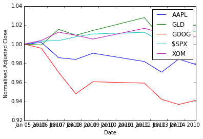

# Week 3: NumPy, QSTK/Pandas Demo, Homework 1 and Interview with Tom Sosnoff

## NumPy tutorial
[(read the tutorial script)](http://wiki.quantsoftware.org/index.php?title=Numpy_Tutorial_1)

### Many ways

There are many ways to go through a programming tutorial. My two
favourite ways to red a Python tutorial are

* to open the tutorial script in emacs in python-mode. There are [nice
extensions](github.com/gabrielelanaro/emacs-for-python) worth using, or
* to go through the tutorial by copy-pasting it in [an IPython Notebook](http://ipython.org/ipython-doc/stable/interactive/notebook.html)

To run IPython and copy-paste things in it, you don't need to change
directory, but in case you may want to run a script
(```execfile('script.py')```), import something local to that
directory (```import mylibrary as mlib```) or output
something, it's better to be in the right place fromt the start.

<div class="highlight"><pre><code>cd dev/coursera-comp-invest-1/Examples/Basic</code></pre></div>

Activate the virtualenv, start iPython

<div class="highlight"><pre><code>workon finance64
ipython</code></pre></div>

The rest of this section is copied from the Quantsoftware
wiki-based [Numpy
tutorial](http://wiki.quantsoftware.org/index.php?title=Numpy_Tutorial_1),
with a few additional comments of my own.

As an alternative, if you want to see the Python interpreter
output without running the tutorial, you can 

* [read it as a fomatted IPython
notebook](quantsoftware_numpy_tutorial.html), or
* [read the same IPython Notebook on
  nbviewer](http://nbviewer.ipython.org/urls/raw.github.com/agravier/agravier.github.io/master/etc/notes/ci1-coursera/quantsoftware_numpy_tutorial.ipynb), or
* [download the
notebook](https://raw.github.com/agravier/agravier.github.io/master/etc/notes/ci1-coursera/quantsoftware_numpy_tutorial.ipynb)
for your own usage.

### Importing Numpy
[(watch section)](https://class.coursera.org/compinvesting1-003/lecture/view?lecture_id=147)  

The following loads the numpy library and lets us refer to it by the shorthand "np",
which is the convention used in the numpy documentation and in many
online tutorials/examples.

import numpy as np


### Creating arrays 

Now lets make an array to play around with. You can make numpy arrays
in a number of ways, filled with zeros. Here, the argument ```(2,3)```
is of basic type ```tuple```.


zeroArray = np.zeros( (2,3) ) # [[ 0.  0.  0.]
print zeroArray               #  [ 0.  0.  0.]]


Or ones:

oneArray = np.ones( (2,3) )   # [[ 1.  1.  1.]
print oneArray                #  [ 1.  1.  1.]]


Or filled with junk:

emptyArray = np.empty( (2,3) ) 
print emptyArray


Note, emptyArray might look random, but it's just uninitialized which means
you shouldn't count on it having any particular data in it, even random
data! If you do want random data you can use random():

randomArray = np.random.random( (2,3) )
print randomArray


If you're following along and trying these commands out, you should have
noticed that making randomArray took a lot longer than emptyArray. That's
because np.random.random(...) is actually using a random number generator
to fill in each of the spots in the array with a randomly sampled number
from 0 to 1.

You can also create an array by hand:

foo = [ [1,2,3],
        [4,5,6]]
myArray = np.array(foo) # [[1 2 3] 
print myArray           #  [4 5 6]]


### Reshaping arrays
Of course, if you're typing out a range for a larger matrix, it's easier to
use arange(...):

rangeArray = np.arange(6,12).reshape( (2,3) ) # [[ 6  7  8]
print rangeArray                              #  [ 9 10 11]]


there's two things going on here. First, the arange(...) function returns a
1D array similar to what you'd get from using the built-in python function
range(...) with the same arguments, except it returns a numpy array
instead of a list.

print np.arange(6,12) # [ 6  7  8  9 10 11 12]


the reshape method takes the data in an existing array, and stuffs it into
an array with the given shape and returns it.  

print rangeArray.reshape( (3,2) ) # [[ 6  7]
                                  #  [ 8  9]
                                  #  [10 11]]


The original array doesn't change though.

print rangeArray # [[ 6  7  8]
                 #  [ 9 10 11]


[(watch section)](https://class.coursera.org/compinvesting1-003/lecture/view?lecture_id=149)

When you use reshape(...) the total number of things in the array must stay
the same. So reshaping an array with 2 rows and 3 columns into one with 
3 rows and 2 columns is fine, but 3x3 or 1x5 won't work

# print rangeArray.reshape( (3,3) ) #ERROR
squareArray = np.arange(1,10).reshape( (3,3) ) #this is fine, 9 elements


### Accessing array elements

Accessing an array is also pretty straight forward. You access a specific
spot in the table by referring to its row and column inside square braces
after the array:

print rangeArray[0,1] #7


Note that row and column numbers start from 0, not 1! Numpy also lets you 
refer to ranges inside an array (note that the lower bound is
included, and the upper bound is excluded):

print rangeArray[0,0:2] #[6 7]
print squareArray[0:2,0:2] #[[1 2]  # the top left corner of squareArray
                           # [4 5]]


These ranges work just like slices and python lists. n:m:t specifies a range
that starts at n, and stops before m, in steps of size t. If any of these 
are left off, they're assumed to be the start, the end+1, and 1 respectively

print squareArray[:,0:3:2] #[[1 3]   #skip the middle column
                           # [4 6]
                           # [7 9]]


Also like python lists, you can assign values to specific positions, or
ranges of values to slices

squareArray[0,:] = np.array(range(1,4)) #set the first row to 1,2,3
squareArray[1,1] = 0                    # set the middle spot to zero
squareArray[2,:] = 1                    # set the last row to ones
print squareArray                       # [[1 2 3]
                                        #  [4 0 6]
                                        #  [1 1 1]]


Something new to numpy arrays is indexing using an array of indices:

fibIndices = np.array( [1, 1, 2, 3] )
randomRow = np.random.random( (10,1) ) # an array of 10 random numbers
print randomRow
print randomRow[fibIndices] # the first, first, second and third element of
                             # randomRow 


You can also use an array of true/false values to index:

boolIndices = np.array( [[ True, False,  True],
                          [False,  True, False],
                          [ True, False,  True]] )
print squareArray[boolIndices] # a 1D array with the selected values
                                # [1 3 0 1 1]


It gets a little more complicated with 2D (and higher) arrays.  You need
two index arrays for a 2D array:

rows = np.array( [[0,0],[2,2]] ) #get the corners of our square array
cols = np.array( [[0,2],[0,2]] )
print squareArray[rows,cols]     #[[1 3]
                                 # [1 1]]
boolRows = np.array( [False, True, False] ) # just the middle row
boolCols = np.array( [True, False, True] )  # Not the middle column
print squareArray[boolRows,boolCols]        # [4 6]


### Operations on arrays

One useful trick is to create a boolean matrix based on some test and use
that as an index in order to get the elements of a matrix that pass the
test:

sqAverage = np.average(squareArray) # average(...) returns the average of all
                                    # the elements in the given array
betterThanAverage = squareArray > sqAverage
print betterThanAverage             #[[False False  True]
                                    # [ True False  True]
                                    # [False False False]]
print squareArray[betterThanAverage] #[3 4 6]


[(watch
section)](https://class.coursera.org/compinvesting1-003/lecture/view?lecture_id=151)
(beware, the video follows another version of the tutorial, and
squareArray is different)

Note that a python assignment ```b = a``` from an ***object*** named
_a_ to another name _b_ only copies the reference to the object, so
mutating the original _a_ results in those changes bing reflected
through _b_. To get a copy, objects assignment is not enough, a copy
must be made too: ```b = a.copy()```. That remark is also valid for numpy
arrays.

Indexing like this can also be used to assign values to elements of the
array. This is particularly useful if you want to filter an array, say by 
making sure that all of its values are above/below a certain threshold:

sqStdDev = np.std(squareArray) # std(...) returns the standard deviation of
                               # all the elements in the given array
clampedSqArray = np.array(squareArray.copy(), dtype=float) 
                                    # make a copy of squareArray that will
                                    # be "clamped". It will only contain
                                    # values within one standard deviation
                                    # of the mean. Values that are too low
                                    # or to high will be set to the min
                                    # and max respectively. We set 
                                    # dtype=float because sqAverage
                                    # and sqStdDev are floating point
                                    # numbers, and we don't want to 
                                    # truncate them down to integers.
clampedSqArray[ (squareArray-sqAverage) > sqStdDev ] = sqAverage+sqStdDev
clampedSqArray[ (squareArray-sqAverage) < -sqStdDev ] = sqAverage-sqStdDev
print clampedSqArray # [[ 1.          2.          3.        ]
                     #  [ 3.90272394  0.31949828  3.90272394]
                     #  [ 1.          1.          1.        ]]



Multiplying and dividing arrays by numbers does what you'd expect. It
multiples/divides element-wise

print squareArray * 2 # [[ 2  4  6]
                      #  [ 8  0 12]
                      #  [ 2  2  2]]


Addition works similarly:

print squareArray + np.ones( (3,3) ) #[[2 3 4]
                                     # [5 1 7]
                                     # [2 2 2]]


Multiplying two arrays together (of the same size) is also element wise

print squareArray * np.arange(1,10).reshape( (3,3) ) #[[ 1  4  9]
                                                     # [16  0 36]
                                                     # [ 7  8  9]]


Unless you use the dot(...) function, which does matrix multiplication
from linear algebra:

matA = np.array( [[1,2],[3,4]] )
matB = np.array( [[5,6],[7,8]] )
print np.dot(matA,matB) #[[19 22]
                        # [43 50]]


And thats it! There's a lot more to the numpy library, and there are a few
things I skipped over here, such as what happens when array dimensions
don't line up when you're indexing or multiplying them together, so if 
you're interested, I strongly suggest you head over to the [scipy wiki's
numpy tutorial](http://www.scipy.org/Tentative_NumPy_Tutorial) for a more in depth look at using numpy arrays.


## QSTK Demo

[(watch section)](https://class.coursera.org/compinvesting1-003/lecture/view?lec
ture_id=163)
[(read the wiki)](http://wiki.quantsoftware.org/index.php?title=QSTK_Tutorial_1)

The following is the output of an iPython notebook.

* [download the
notebook](https://raw.github.com/agravier/agravier.github.io/master/etc/notes/ci1-coursera/qstk_tutorial_1.ipynb))
(* [read it on
  nbviewer](http://nbviewer.ipython.org/urls/raw.github.com/agravier/agravier.github.io/master/etc/notes/ci1-coursera/qstk_tutorial_1.ipynb), or
### Imports

* numpy, pylab and matplotlib provide a number of functions to Python that give
it MATLAB-like capabilities.
* datetime helps us manipulate dates.
* The qstkutil items are from the QuantSoftware ToolKit


 ```Input:```

import QSTK.qstkutil.qsdateutil as du
import QSTK.qstkutil.tsutil as tsu
import QSTK.qstkutil.DataAccess as da

import datetime as dt
import matplotlib.pyplot as plt
import pandas as pd


Some notebook magic, please ignore


 ```Input:```

%matplotlib inline


### Some symbols and dates

We'll be using historical adjusted close data. QSTK has a DataAccess class
designed to quickly read this data into pandas DataFrame object. We must first
select which symbols we're interested in, and for which time periods. Note that
the wiki tutorial script uses 2006, but in the video tutorial, we use 2010. The
end date differs to so as we have 2 weeks of data. SPX is the S&P 500.


 ```Input:```

ls_symbols = ["AAPL", "GLD", "GOOG", "$SPX", "XOM"]
dt_start = dt.datetime(2010, 1, 1)
dt_end = dt.datetime(2010, 1, 15)


The time at which the market closes is 16:00.


 ```Input:```

dt_timeofday = dt.timedelta(hours=16)


The function ```getNYSEdays(dt_start, dt_end, dt_timeofday)``` returns the days
of the interval for which the New York stock exchange was open. It adds  the
time of day given as param to each datetime member of the result list.


 ```Input:```

ldt_timestamps = du.getNYSEdays(dt_start, dt_end, dt_timeofday)



 ```Input:```

ldt_timestamps



```Output:```
    [Timestamp('2010-01-04 16:00:00', tz=None),
     Timestamp('2010-01-05 16:00:00', tz=None),
     Timestamp('2010-01-06 16:00:00', tz=None),
     Timestamp('2010-01-07 16:00:00', tz=None),
     Timestamp('2010-01-08 16:00:00', tz=None),
     Timestamp('2010-01-11 16:00:00', tz=None),
     Timestamp('2010-01-12 16:00:00', tz=None),
     Timestamp('2010-01-13 16:00:00', tz=None),
     Timestamp('2010-01-14 16:00:00', tz=None)]


Note than Jan 4 was the first open day of the interval, and Jan 14, the last.

### Data access

Create an object that will be ready to read from our Yahoo data source


 ```Input:```

c_dataobj = da.DataAccess('Yahoo')


```c_dataobj.get_data``` creates a list of dataframe objects. The dict-zipping
converts this list into a dictionary for easier access.


 ```Input:```

ls_keys = ['open', 'high', 'low', 'close', 'volume', 'actual_close']
ldf_data = c_dataobj.get_data(ldt_timestamps, ls_symbols, ls_keys)
d_data = dict(zip(ls_keys, ldf_data))


Note that in the list of keys, ```'close'``` refers to adjusted close, and
actual_close is the raw close price. Looking at the type of the object created
by get_data


 ```Input:```

ldf_data.__class__, ldf_data[1].__class__



```Output:```
    (list, pandas.core.frame.DataFrame)


 ```Input:```

d_data['close']



```Output:```
<div style="max-height:1000px;max-width:1500px;overflow:auto;">
<table border="1" class="dataframe">
  <thead>
    <tr style="text-align: right;">
      <th></th>
      <th>AAPL</th>
      <th>GLD</th>
      <th>GOOG</th>
      <th>$SPX</th>
      <th>XOM</th>
    </tr>
  </thead>
  <tbody>
    <tr>
      <th>2010-01-04 16:00:00</th>
      <td> 213.10</td>
      <td> 109.80</td>
      <td> 626.75</td>
      <td> 1132.99</td>
      <td> 64.55</td>
    </tr>
    <tr>
      <th>2010-01-05 16:00:00</th>
      <td> 213.46</td>
      <td> 109.70</td>
      <td> 623.99</td>
      <td> 1136.52</td>
      <td> 64.80</td>
    </tr>
    <tr>
      <th>2010-01-06 16:00:00</th>
      <td> 210.07</td>
      <td> 111.51</td>
      <td> 608.26</td>
      <td> 1137.14</td>
      <td> 65.36</td>
    </tr>
    <tr>
      <th>2010-01-07 16:00:00</th>
      <td> 209.68</td>
      <td> 110.82</td>
      <td> 594.10</td>
      <td> 1141.69</td>
      <td> 65.15</td>
    </tr>
    <tr>
      <th>2010-01-08 16:00:00</th>
      <td> 211.07</td>
      <td> 111.37</td>
      <td> 602.02</td>
      <td> 1144.98</td>
      <td> 64.89</td>
    </tr>
    <tr>
      <th>2010-01-11 16:00:00</th>
      <td> 209.21</td>
      <td> 112.85</td>
      <td> 601.11</td>
      <td> 1146.98</td>
      <td> 65.62</td>
    </tr>
    <tr>
      <th>2010-01-12 16:00:00</th>
      <td> 206.83</td>
      <td> 110.49</td>
      <td> 590.48</td>
      <td> 1136.22</td>
      <td> 65.29</td>
    </tr>
    <tr>
      <th>2010-01-13 16:00:00</th>
      <td> 209.75</td>
      <td> 111.54</td>
      <td> 587.09</td>
      <td> 1145.68</td>
      <td> 65.03</td>
    </tr>
    <tr>
      <th>2010-01-14 16:00:00</th>
      <td> 208.53</td>
      <td> 112.03</td>
      <td> 589.85</td>
      <td> 1148.46</td>
      <td> 65.04</td>
    </tr>
  </tbody>
</table>
</div>


### Drawing a figure

We pull the close prices we cant to plot out of the pandas dataframe, into a 2D
numpy array.


 ```Input:```

na_price = d_data['close'].values


Now, plotting with matplotlib. Here we first clear the plot (```clf```), plot
the data, and then modify the plot to add a legend and some labels.


 ```Input:```

plt.clf()
plt.plot(ldt_timestamps, na_price)
plt.legend(ls_symbols)
plt.ylabel('Adjusted Close')
plt.xlabel('Date')



```Output:```
    <matplotlib.text.Text at 0x4a9c2d0>


To save a PDF file containing the plot:


 ```Input:```

plt.savefig('adjustedclose.pdf', format='pdf')



```Output:```
    <matplotlib.figure.Figure at 0x4923310>


### Data normalisation
[(watch section)](https://class.coursera.org/compinvesting1-003/lecture/view?lec
ture_id=165)

To better see the variations, we normalize the data with respect to the first
day's price (so we divide all rows by the first row).


 ```Input:```

na_normalized_price = na_price / na_price[0, :]


Plotting:


 ```Input:```

plt.clf()
plt.plot(ldt_timestamps, na_normalized_price)
plt.legend(ls_symbols)
plt.ylabel('Normalised Adjusted Close')
plt.xlabel('Date')



```Output:```
    <matplotlib.text.Text at 0x4d04110>





### Daily returns
**(From here, there are no video tutorials, only the wiki)**

The QSTK function ```returnize0``` computes the daily return of stocks
(remember, \\(\text{ret}(t) = \frac{\text{price}(t)}{\text{price}(t-1)} -1\\)).
Beware, ```returnize0``` mutates the array. Make a copy first:


 ```Input:```

na_rets = na_normalized_price.copy()
tsu.returnize0(na_rets)



```Output:```
    array([[ 0.        ,  0.        ,  0.        ,  0.        ,  0.        ],
           [ 0.00168935, -0.00091075, -0.00440367,  0.00311565,  0.00387297],
           [-0.0158812 ,  0.01649954, -0.02520874,  0.00054552,  0.00864198],
           [-0.00185652, -0.00618779, -0.02327952,  0.00400127, -0.00321297],
           [ 0.00662915,  0.004963  ,  0.01333109,  0.00288169, -0.00399079],
           [-0.00881224,  0.01328904, -0.00151158,  0.00174676,  0.01124981],
           [-0.01137613, -0.02091272, -0.01768395, -0.00938116, -0.00502895],
           [ 0.01411787,  0.00950312, -0.00574109,  0.00832585, -0.00398223],
           [-0.00581645,  0.00439304,  0.00470115,  0.00242651,  0.00015378]])


 ```Input:```

plt.clf()
plt.plot(ldt_timestamps[0:50], na_rets[0:50, 3])  # $SPX 50 days
plt.plot(ldt_timestamps[0:50], na_rets[0:50, 4])  # XOM 50 days
plt.axhline(y=0, color='r')
plt.legend(['$SPX', 'XOM'])
plt.ylabel('Daily Returns')
plt.xlabel('Date')



```Output:```
    <matplotlib.text.Text at 0x4923a90>


### Scatter plots

To estimate the correlation between two securities. Let's work with more data
first.


 ```Input:```

dt_start = dt.datetime(2006, 1, 1)
dt_end = dt.datetime(2010, 12, 31)
ldt_timestamps = du.getNYSEdays(dt_start, dt_end, dt_timeofday)
d_data = dict(zip(ls_keys, c_dataobj.get_data(ldt_timestamps, ls_symbols, ls_keys)))


Filling the data for NAN: we apply the filling functions in decreasing order of
preference.


 ```Input:```

for s_key in ls_keys:
    d_data[s_key] = d_data[s_key].fillna(method='ffill')
    d_data[s_key] = d_data[s_key].fillna(method='bfill')
    d_data[s_key] = d_data[s_key].fillna(1.0)


Getting the numpy ndarray of close prices.


 ```Input:```

na_price = d_data['close'].values
na_normalized_price = na_price / na_price[0, :]
na_rets = na_normalized_price.copy()
tsu.returnize0(na_rets);


XOM vs. S&P 500:


 ```Input:```

plt.clf()
plt.scatter(na_rets[:, 3], na_rets[:, 4], c='blue')
plt.ylabel('XOM')
plt.xlabel('$SPX')



```Output:```
    <matplotlib.text.Text at 0x4fe8850>


Plotting the scatter plot of daily returns between $SPX VS GLD


 ```Input:```

plt.clf()
plt.scatter(na_rets[:, 3], na_rets[:, 1], c='yellow')
plt.ylabel('GLD')
plt.xlabel('$SPX')



```Output:```
    <matplotlib.text.Text at 0x5003f50>


## QSTK Exercises

### Exercise: Cumulative Daily Returns

Using the daily returns we can reconstruct cumulative daily returns. Note that
in general the cumulative daily return for day t is defined as follows (this is
NOT Python code, it is an equation):

 ```Input:```

daily_cum_ret(t) = daily_cum_ret(t-1) * (1 + daily_ret(t))


I don't provide the code for this, as it is a programming assignment. If you
plot the result, it should look exactly like the normalized returns plot above.

#### Answer


 ```Input:```

import numpy as np

def daily_cum_ret(np_arr):
    "Reconstructs the cumulative returns from daily returns."
    assert np_arr.size != 0
    dcr = np.empty_like(np_arr, dtype=float)
    dcr[0] = 1
    for ri in xrange(1, np_arr.shape[0]):
        dcr[ri] = dcr[ri-1] * (1+np_arr[ri])
    return dcr

# For comparison
plt.clf()
plt.figure(figsize=(8,16))
plt.subplot(311)
plt.plot(ldt_timestamps, na_normalized_price)
plt.ylabel('Normalised Adjusted Close')
plt.xlabel('Date')

# Our reconstruction
plt.subplot(312)
plt.plot(ldt_timestamps, daily_cum_ret(na_rets))
plt.ylabel('Reconstructed Normalised Adjusted Close')
plt.xlabel('Date')

# floating poing operations cumulative error
err = na_normalized_price - daily_cum_ret(na_rets)
plt.subplot(313)
plt.plot(ldt_timestamps, err)
plt.ylabel('Reconstruction error')
plt.xlabel('Date')



```Output:```
    <matplotlib.text.Text at 0x5824790>


```Output:```
    <matplotlib.figure.Figure at 0x564f190>


### Exercise: Combining Daily Returns To Estimate Portfolio Returns

Suppose we want to estimate the performance of a portfolio composed of 75% GLD
and 25% SPY? We can approximate the daily returns in an equation as follows:

    portfolio_daily_rets = 0.75 * GLD_daily_rets + 0.25 * SPY_daily_rets

Then, using the equation above for cumulative daily returns, we can plot the
performance of the combined portfolio. This also is an assignment in my course,
so I don't list the code for it here.

#### Answer

As I am lazy, I approximate \\(\text{SPX} \approx \text{SPY}\\)


 ```Input:```

p_rets = na_rets[:, 3] * 0.25 + na_rets[:, 1] * 0.75
na_plot_cumul_rets = daily_cum_ret(np.concatenate([na_rets[:, [1, 3]], p_rets[:, np.newaxis]], axis=1))

plt.clf()
plt.plot(ldt_timestamps, na_plot_cumul_rets)
plt.legend(["GLD", "S&P 500", "portf."])
plt.ylabel('Cumulative returns')
plt.xlabel('Date')



```Output:```
    <matplotlib.text.Text at 0x5c08350>


### Exercise: Line fit to Daily Returns

Finally, we revisit the scatterplots above that reveal visually how closely
correlated (related) the daily movement of two stocks are. It's even better if
can quantify this correlation by fitting a line to them using linear regression.
Note the red line in the figure on the right; this was computed using one of
NumPy's linear regression tools. The value of the slope of the line is reported
as "corr" which is technically not correct.

Wikipedia has [a nice
discussion](http://en.wikipedia.org/wiki/Correlation_and_dependence) of
correlation.

Again, I'm not going to show the code here, but I will tell you that the code is
not very complex, and I used the following functions: polyfit(), polyval(), and
sort().

#### Answer

Note that there is no figure on the wiki. So I choose to fit the XOM
scatterplot. I also don't use the same functions as the instructor, but my
version works too.


 ```Input:```

spx_rets, xom_rets = na_rets[:, 3], na_rets[:, 4]
coefs = np.polyfit(x=spx_rets, y=xom_rets, deg=1)
fit_f = np.poly1d(coefs)
fit_x = [np.amin(spx_rets), np.amax(spx_rets)]
fit_y = fit_f(fit_x)

plt.clf()
plt.scatter(spx_rets, xom_rets, c='blue')
plt.plot(fit_x, fit_y, c='red')
plt.ylabel('XOM')
plt.xlabel('$SPX')



```Output:```
    <matplotlib.text.Text at 0x5e701d0>


## Homework 1


## Interview with Tom Sosnoff

