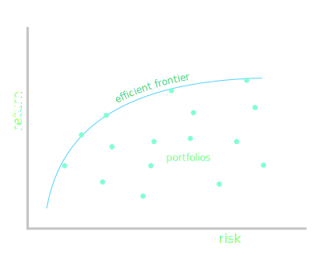

# Week 4: Efficient Markets Hypothesis and Event Studies

## Information
[(watch section)](https://class.coursera.org/compinvesting1-003/lecture/view?lecture_id=83)

Most quant-based investing are based on some arbitrage model. We are looking for an arbitrage between the price of the equity on the market and what we believe is its true value.

Assumption: the market price should be very close to that true value. A divergence will return to the true value.

Under that assumption, we should buy when the equity is undervalued, and short when the quoted market price is significantly above the true value.

We're looking for market relative value, so for instance, the value in the divergence between S&P 500 and an equity.

### How to calculate the underlying value?

2 methods:

* **technical analysis** is based on price and volume only,
* **fundamental analysis** is based on financial statements and ratios like price earnings ratio, cash on hands, dividends, etc...

To assess the try value of a company, there are 3 key sources of information:

* price/volume is directly obtained from the market,
* fundamentals are available in the US through the Securities and Exchange Commission (SEC),
* news telling either about the market overall or about the company specifically.

News can be made available to investors through dedicated high speed services.

### The efficient market hypothesis
[(watch section)](https://class.coursera.org/compinvesting1-003/lecture/view?lecture_id=85)

The EMH relates to which source of information may not be exploitable to find arbitrage opportunities. 

As the EMH says that stock price movements already reflect what the market believes the true value to be, there is no reason to expect it to come back to our estimated value.

There are 3 versions of the efficient market hypothesis, some of which may allow some arbitrage:

* **weak EMH**: current process reflect all past publicly available information. Assuming that version, it implies that there is no extra information in past price/volume data, and *technical analysis is moot*. However, current information may still be exploitable.
* **semi-strong EMH**: current process reflect all past publicly available information and change instantly to reflect new public information. Hence, *technical analysis and fundamental analysis are useless*
* **strong EMH**: current process reflect all past information and change instantly to reflect public and hidden "insider" information. The strong EMH prohibits profit from all types of information, even insider information. The strong version is unfortunately regularly proven false.

But is any version true?

#### Evidence that the EMH is wrong

#####  P/E ratios vs. annualised return

Price/earnings ratio (P/E): \\(=\frac{\text{share price}}{\text{earnings per share}}\\) over a recent period of time (last 4 quarters, for instance). The earnings per share (for a year) are \\(\frac{\text{net income for the year}}{\text{weighted average number of shares over the year}}. Use the weighted average number of shares over the period of reporting because the number of shares can vary. 

Projected P/E uses forecasted price and earnings. 

Generally, a high P/E ratio means that investors are anticipating higher growth in the future.

In a book by Robert Shiller (Irrational Exuberance, 2005), there is a graph  of P/E ratios vs. annualised return 20 years later for many companies. The P/E ratio is negatively correlated with the annualised return 20 years later. 

The lower the P/E, the higher the annualised return. That indicates that the semi-strong version of the EMH is false, and fundamental information is correlated with future returns.

##### Behavioural economics

According to behavioural economics, prices are not only influenced by the underlying value of the company and the news, but also by human psychological factors and biases: emotions, overconfidence, bias towards some sources of information, etc.

Example: strong drop in price in response to news that often gradually returns back up 

### Event studies
[(watch section)](https://class.coursera.org/compinvesting1-003/lecture/view?lecture_id=89)

Coming back on the paper by McKinlay that we saw in [Week 2](notes02.html), that introduced event studies (MacKinlay, A. C. “Event Studies in Economics and Finance,” Journal of Economic Literature Vol. XXXV, Issue 1, 1997).

The documented the dates of positive, negative, and random news events for 1700 stocks, looked at how the valency of events correlated with price changes of the concerned stocks.

McKinlay takes a $\pm$20-days window centred on each event, clusters them by valency, and shifts them to a common value of 0 at t-20 to extract changes in value. For each clusters, he plots the mean of those shifted daily prices. 

The plot of average stock price change for negative news events shows a sharp drop the day after the event. 

For positive news events, it's a sharp rise the day after the event. 

For neutral news, there is no change.

Before the event, the stock price drifts in the direction of the sharp change. It could be because of:

* insider information
* pre-existing bad trend

For negative events, the sharp negative reaction is followed by a recovery. For good news, the surge in price is not followed by a negative rebound, it just levels off. However, without confidence intervals, it's hard to be sure about those things.

Part of QSDK includes code to do event studies. Given several stocks' price history and an event at time *t*, the event study function of QSDK goes through each stock's history to the event time, cuts off a centred window around it, aligns all histories on that event, and takes the mean of all those centred histories and draws a char with it. It draws standard deviation error bars around each point.

Such chart allows to quantitatively test the hypothesis that a particular event affects prices. If the error is small, we can predict that that "kind" of event will likely result in the same price reaction, in the future.

## QSDK event studies and homework 2

### Event Studies in QSTK
[(watch section)](https://class.coursera.org/compinvesting1-003/lecture/view?lecture_id=167)

Event studies work best on many events. 

QSTK has an event profiler. It lets the user scan through a dataframes of dates $\times\ stocks and input 1 where there is an event and NaN where there is no event. Afterwards, the plotting software takes charge of the plotting.

### QSTK tutorial 9

In the EventProfiler folder, there is a tutorial script that corresponds to QSTK tutorial 9. When you open it and scroll to the definition of ``__main__``. After the creation of the usual object to access data, there is a call to its get_symbol_from_list method with a filename as parameter. This file contains the symbols of all members of S&P500 in 2012 (as it's the top 500 caps in the market, it changes year to year).

The event profiler takes out the market, to do market relative computations. For that, we also add SPY to the list of symbols as a representation of the market.

The find_events function takes a list of symbols and the dict-zipped stock data from which it extracts close data for all symbols and for the market SPY, and makes a copy of their structure, filled with NaN. A NaN represents no event. 

Then, it determines if an event occurs. An event is said to occur if a stock goes down 3% or more while the market went up 2% or more. The following pseudocode explains the alto implemented by find_event:

<pre><code>
for each (symbol x timestamp):
  let [ $s_t$ the price of the symbol today (i.e. for current timestamp),
        s_{t-1} the price of the symbol yesterday,
        m_t the price of the market today,
        m_{t-1} the price of the market yesterday ] in
     today's market return r_m = (m_t)/(m_{t-1}) - 1
     today's return for symbol r_s = (s_t)/(s_{t-1}) - 1
     event matrix[symbol, timestamp] <- 
       r_s <= -0.03 and r_m >= 0.02 ? 1 : NaN
</code></pre>

       
The event matrix is given to an event profiler along with the price data, the lookback and lookforward sizes to make the time window around the events, a flag indicating that we want market-neutral event studies, and some output parameters. Note that events that happen in the beginning of the time series, with less than lookback days of slack time in front, or those that happen in the end, with less than look forward days in front, are discarded. The number of events counted in the event matrix can be larger than the number of events used by the profiler. 

> In the assignment, when asked to report the number of events that occurred, you are to report the number calculated by the event profiler, meaning without those that don't have enough data to fit the time window around them!

Hindsight time: the output of the event study shows that if we had invested in each of those stocks each time there was a drop of 5% or more relative to the market, and systematically sold 12 days later, we would have made an overall profit of 5%.

### Homework 2 Overview
[(watch section)](https://class.coursera.org/compinvesting1-003/lecture/view?lecture_id=169)

This homework explores a new and different event, simpler than the one from the example. We are given 2 lists of symbols: the **S&P 500 equities for 2008** and those for **2012**. We are to run an event study for these 2 lists of symbols, but **both on the period from Jan 1, 2008 to Dec 31, 2009**. The event we are looking for is one where the **actual closing** price of the stock was equal to $5 or more the day before the event, and less than $5 on the day of the event. Note, we use **actual close, not adjusted**. Make changes to the code for tutorial 9 to get the right events, etc.

This is interesting because when the listed price of a stock drops below $5, it sometimes can't be in S&P 500 anymore, or can't be listed in some exchanges anymore (there are rules about which stock can be in S&P 505, or listed in major exchanges). In 2008-2009 they suspended some of these rules. Also, funds and ETFs often have rules stating that they won't hold equities below $5.

The even study graphs will be different. Why?

Before beginning the project, for which set of stocks would you expect the events to be more positive?

Once the code is ready, compare with example outputs.

Extra: think about different event definitions and try if they give interesting results

## Portfolio Optimisation and the Efficient Frontier
[(watch section)](https://class.coursera.org/compinvesting1-003/lecture/view?lecture_id=95)

The goals of this module are to understand: 

* **risk**
* **correlation** and **covariance** between stocks
* mean variance optimisation

### Optimisation overview

*Portfolio optimisation*: allocation of resources in to a set of equities to minimise risk and reach a target return. Given a set of equities, how much of the resources to allocate to each to minimise risk while reaching the target return.

#### What is risk?

In this class, risk = volatility measured as standard deviation of daily return. There are other measures: max drawdown, probability of drawdown.

Imagine equity XYZ that's make 10% after a period of time, but has been quite volatile. ABC has also made 10%, but with much less volatility. The second investment is preferable.

Let's consider equities in 2 dimensions: return, which we are to maximise, and risk, to be minimised. We can scatter plot all our equities in this <return, risk> space. The resulting portfolio also has its place in this chart. We want it to be in the upper-left hand corner of the chart, but unfortunately, the high-return equities also have the highest risk. But thanks to Markowitz' Modern Portfolio Theory, **an optimised portfolio can have a lower risk than any of its constituent equities**. For that, we perform **mean variance optimisation**. 

### The inputs and outputs of a portfolio optimiser
[(watch section)](https://class.coursera.org/compinvesting1-003/lecture/view?lecture_id=97)

The best portfolio is not necessarily the one that maximises return. Rather, most people in finance see it as a balance between reward and risk. For instance, Sharpe ratio.

A portfolio optimiser exploits some information about how equities work together to minimise risk.

#### Inputs to the portfolio optimiser

* Expected return for each equity. This might be beaded on historical data, or ML-based forecasting. Or some expert's opinion
* Risk of each equity, most often based on historical data
* Target return of the portfolio
* **Covariance matrix** of the equities

#### Output

* Set of weights to allocate each equity

### Correlation and covariance between equities
[(watch section)](https://class.coursera.org/compinvesting1-003/lecture/view?lecture_id=99)

A portfolio's risk is not necessarily the weighted average of its constituent equities. It can be made lower by looking at the **correlation of daily returns of equities**.

Imagine 3 stocks with the same total return. Stock GHI moves in opposite direction of stocks ABC and DEF. The correlation of ABC and DEF is positive, say 0.9, and between GHI and any other it's negative, for instance, corr(ABC, GHI) = -0.9.

If we built a portfolio of 50% ABC and 50% DEF, the resulting portfolio lacks diversity, and although the end result has the average return of ABC and GHI, the risk is about that of ABC or of GHI.

However, a portfolio made of 25% ABC, 25% DEF and 50% GHI has still the same return, but has a much lower risk than any of its components.

### The efficient frontier
[(watch section)](https://class.coursera.org/compinvesting1-003/lecture/view?lecture_id=101)

A lower risk portfolio built by a portfolio optimiser it optimised for a given target return. That is, in the <risk, return> space, we optimise the portfolio to have the leftmost risk along one line of constant return.

Overall, there is an infinite number of possible portfolios, but all are bound to be below an efficient frontier line:

Optimal portfolios are on the efficient frontier, which, by virtue of its positive convexity, constrains higher desired returns to imply higher risks.

On the efficient frontier:

* the highest return portfolio is comprised of 100% of the highest return equity. 
* the lost risk portfolio doesn't necessarily have a positive return! 
* the portfolio that maximises the Sharpe ratio is in between

We might have additional constraints, for instance that prevent to have more than X% of a particular equity, or to prevent negative returns when looking for the lowest risk portfolio.

### How optimisers work
[(watch section)](https://class.coursera.org/compinvesting1-003/lecture/view?lecture_id=103)

QSTK tutorial 8 explores optimisation.

#### General idea

A portfolio optimiser leverages the properties of an **optimising algorithm** to optimise a portfolio.

1. Define variables that the optimiser will modify: the weights of each equity in the portfolio.
2. Define constraints. For instance, the sum of all weights adds up to 1, some specific equities must be at least 5% of the portfolio, etc...
3. Define the optimisation criteria: the function of variables to optimise. In this case, the function to optimise is risk.

With that, the optimiser tries to optimiser tweaks the variables (weights), while checking the constraints, checks the value of the function bing optimised, and repeats until an optimum is reached.

QSTK uses [cvxopt](http://cvxopt.org/), which is a convex function optimiser. So, QSTK assumes that the optimised function is **convex**, which implies that there is no local optimum, so optimisation is much easier.

### Summary 

Given the covariance matrix of equities, their volatilities and a target return, we can find an optimal portfolio that minimises risk. 
