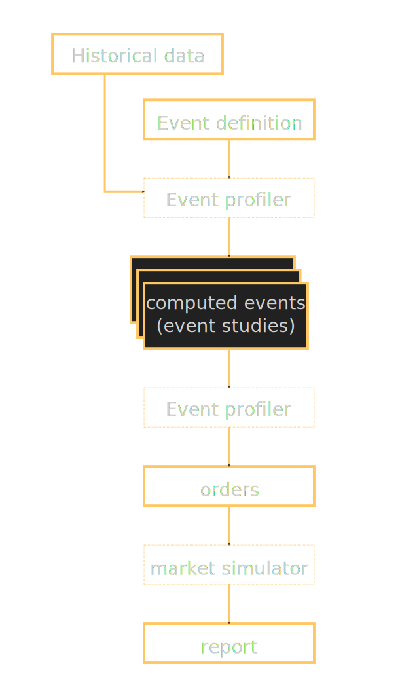

# Week 5: Digging Into Data

## Digging Into Data
[(watch section)](https://class.coursera.org/compinvesting1-003/lecture/view?lecture_id=105)

Historical data is useful to look at how securities move in the past relative to one another.

Goals for this week:

* how to read an event study and correctly understand $5 events
* survivor biased data
* adjusted and actual historical price data
* data sanitation

### Example of an event study

This example is based on *Bollinger bands*, which are indicators of extreme price changes. We define an event where the price drops below -1.5 stdev of recent daily values, while SPY remains above 0.25

> In general, to find informative events using technical indicators, we look for situations where the individual stock is doing something different from the market.

In our example, the price drop defined by the event is reliably (small stdev) followed by the price climbing for 7 days, and finally dropping again.

This event was detected 45 times, presumably over a year, so it's not happening very often: if we were to actively trade on it. We would need to also use other strategies.

Trading on this: wait for the event, buy the equity, and wait about 5 days, sell and short, wait some more days, buy back to close the shorting.

T he event study is just the first building block of a strategy, and it is necessary to study that idea much more before actually trading on it.

### The $5 events

In the last course, we asked ourselves why the $5-crossing event studies for 2008-2009 differ when applied on S&P 500/2012 and on S&P 500/2008. 

On the S&P 500/2012 stocks, the event study shows that the average price goes back up about 5%, 20 days after the event. On the S&P 500/2012 stocks, it does not go back up as much.

When you use the S&P 500 **symbols from a certain date** on historical **data from several years prior**, you **bias your dataset** with companies that have **survived**. Between 2008 and 2012, 68 symbols disappeared from S&P 500. Many of those died. 

This is called the *survivor bias*. We need to use data that is survivor-unbiased, meaning that includes both equities that survived and those that died. That is a technical challenge because symbols are reassigned (Sun Microsystems was SUNW, but when Mr Coffee got acquired, its symbol JAVA was deleted, so Sun dropped SUNW and became JAVA, and then Sun got acquired by Oracle and JAVA disappeared again). A database of stock prices can't be indexed by symbols. Commercial solutions provide indexing schemes to work around that issue.

To validate a strategy with data that is survivor biased, we first compute a baseline by creating several random portfolios and averaging their results without strategy. We then compare our strategy to those baseline results. See for instance [*Lisi, Francesco. "Dicing with the market: randomized procedures for evaluation of mutual funds." Quantitative Finance 11.2 (2011): 163-172.*](http://users.telenet.be/webdesignsite/PNB_Paribas/Papers/DIcing_with_the_market_randomizedPortofolios.pdf)

### Actual vs Adjusted Close
[(watch section)](https://class.coursera.org/compinvesting1-003/lecture/view?lecture_id=107)

The adjusted and actual lose data differ for historical prices. The very last (today's) adjusted close price of a series of prices is always the same as the close price. But the farther we look back, the more they differ. For instance, the actual close for IBM on 2 Jan 1962 was $572.00, but the adjusted close is $2.53.

Actual prices are posted on the exchange at the closing of the exchange that day.

Adjusted prices are adjusted for dividends and splits. It is a better indicator of the actual return of the stock. 

#### Splits

On the historical chart of actual close prices of IBM, there is one day in the 70s when the actual close went down from $300 to $75. It's not that the *stock* went down, it's that the *shares* were **split**. On that day, everyone who had one share of IBM got 4 shares.

Stocks are split 

* to **improve liquidity**, as very high stock prices prevent finer-grain operations. 
* to make options less expensive, because one option control a hundred shares...

So, adjusting for splits, the curve becomes much smoother.

Splits, by definition, result in integer ratios: 1 share becomes 2 shares, or 3, 4, etc... To calculate the history of adjusted prices, you go through the actual prices history, back in time from the most recent price, and each time you encounter a split 1:N, you divide all previous prices from that point by N.

#### Dividends

AGNC is an ETF with a 200% increase in actual close prices within 4 years. However, they pay **dividends** quarterly. Looking at the close prices adjusted for dividends, the stock grew by 300%.

Imagine a stock that starts at $10, then grows to $11, at which point it pays a $1 dividend. The graphs of actual close prices looks like a seesaw: steady rise to $11, instant drop to %10, further steady rise, etc... 

The dividend payout happens after the closing of the trading day, and before the opening of the next day, making the opening price lower than the closing price by the value of the dividend. The dividend payment is literally made out of the stock value. So, if you hold one $11 share on the day before the payment, the next day you hold one $10 share plus an extra $1 in cash. As the company take out 1$ per share from the bank to give it to its shareholders, **the book value of the company goes down by $1 \\(\times\\) the number of shares**.

In historical adjusted close prices, the dividends are accounted for by going back in the history of actual close prices, and dividing the all previous prices before a dividend by the ratio of the dividend

### Missing data

In the Pandas data frames used by QSTK, the missing data are represented by NaN entries.

A stock may not trade on some days because of some regulatory issues, or bay be it stops existing, etc. 

These NaN lead to algorithmic problems, as they propagate through most arithmetic operations and are not comparable to numbers.

To solve this, we can

* Fill back the NaN from the first day after the NaN when we have data
* Fill forward from the last day before the NaN for which we have data

You should normally fill forward first. The reason is that the future price contains information, and if you are back-testing on historical data, or performing some sort of simulation, having early access to that information could render the simulation results meaningless. Filling forward prevents from having early access to a future price.

Filling backwards only makes sense at the beginning of the time series, where there is no previous price value. It allows some picking in the future, so you have to keep it in mind in your analysis.

So, to remove NaN, you do, in order:

1. fill forward
2. fill backward

> Summary until now: 
> 
> * Know your data. Is it actual close or adjusted? 
> * If it's adjusted, it's adjusted for what? Google and Yahoo data are adjusted for splits but not for dividends.
> * Know when to use which one, adjusted and actual. To look for patterns, adjusted is easier to work with. But the literal price matters for some events, for instance the $5-cross, and you can't completely analyse the data without taking the actual price into account.
> * When filling NaNs, it's first forwards, second backward.
> * Remember that filled data can be dangerous, in particular backward.

### Data Sanity and Scrubbing
[(watch section)](https://class.coursera.org/compinvesting1-003/lecture/view?lecture_id=109)

If we look up the symbol DD in Google finance, we see that in 1988, it dropped from $15 to $1.50, continued at that level for a year, and then wen back to $15 in the end of the year. 

This is obviously a calculation error. But this sort of data ca wreck havoc in learning algorithms or backtests. An automated strategy will try to take advantage of this apparent price drop, for instance. Garbage in, garbage out.

Data can be bad in many ways. Most commonly:

* failure to adjust for splits, looking like a sudden drop by an integer factor
* More frequently, *reverse splits* that are unaccounted for, where the price suddenly increases by an integer factor
* drops by several orders of magnitude, followed by the reverse multiplication. Can be due to bad data conversion, database rot
* Large chunks of data missing, like all stocks under a range of alphabet letters.

It's so common that your system need to be completely robust to bad data. Otherwise, automated strategies will be tuned to bad data that doesn't match real data, and fail. You might be mislead to think that your software has found an exploitable pattern, when it fact it has not.

#### Sanity checks

Scan data for:

* obvious misses of splits in both directions: integer multiplications and divisions of prices. Flag them, review manually. This is very rare for real data.
* NaNs reveal bad data path
* Recent adjusted prices of less than a penny...
* A stock with NaN for more than 20 days may reveal that it's in the process of being delisted. Flag and review.

#### Fixing the problem

First possibility, throw out problematic equities. 

Second possibility, repair the data. That requires comparing multiple data feeds of the data. With more than 2 feeds, use a majority vote.

Repairing data is challenging.

### Summary

Data is essential. Garbage in, garbage out.

Survivor bias: if you only use companies that survived today, you are not accounting for factors that cause companies to fail.

NaNs? Fill forward, then fill back.

Bad data that misses splits and other issues? Better throw it out if we aren't sure that we can repair it properly.

## Overview of Homework 3

### How the next two homeworks fit together
[(watch section)](https://class.coursera.org/compinvesting1-003/lecture/view?lecture_id=111)

There are 2 projects left in this course. We will use them to make a market simulator and trade with it.

In this project, we make a market simulator.

In the next one, the event study system creates trades in the market simulator.

#### The market simulator

Defining an event and feeding it to the event profiler together with historical data gives statistical events (event studies). The event profiler can chart those events, but it can also create market orders out of them. 

Those orders can then be assessed in a market simulator. The simulator generates a report to assess how useful the event is in the creation of a strategy. 

### Specifications for Homework 3
[(watch section)](https://class.coursera.org/compinvesting1-003/lecture/view?lecture_id=113)

#### marketsim.py

Create a Python program that can accept market orders from a CSV file. Assess the performance of the portfolio created by processing those orders by calculating the Sharpe ratio, total return, stdev. This makes the basis for back-testing.

##### In details:  

Create marketsim.py accepting as arguments:

  * the starting cash amount,
  * the orders list as a CSV, and
  * another CSV filename, where you are to output the total value of the portfolio over time: 

    year, month, day, value

 One line of the orders file is as follows: 

    year, month, day, symbol, buy|sell, qty

The program will go throughout those orders one at a time, calculating the value of the portfolio all along.

marketsim.py should use **adjusted closing prices** for each day, and output the value of the portfolio as **the cash at hand + the value of equities**

#### analyze.py

Create a short Python program, analyze.py, that reads CSV the output of marketsim.py, the name of a benchmark (SPX for us). It plots the price history over the trading period, and prints the Sharpe ratio, the total return, and the stdev of daily return.

#### Testing

There are sample i/o [on the wiki](http://wiki.quantsoftware.org/index.php?title=CompInvesti_Homework_3#Example_Output) to test your implementation.

### Suggestions on Implementation of Homework 3
[(watch section)](https://class.coursera.org/compinvesting1-003/lecture/view?lecture_id=115)

There are many ways to go about implementing this project. Dr Balch suggests the following.

Read the CSV file of trades into a Numpy array called trades, ordered by dates. (Assume that all trades are market orders. It's not necessary to do limit orders and whatnot.)

Ensure that you sort your trades by dates. Orders may not be ordered properly.

Scan the trades to collect all symbols and the range of dates. 

With the range of dates and the list of symbols, read the adjusted close prices like in the previous tutorials. Use getNYSEdays. It gives an array of exactly the right size, use that to make the data processing arrays below.

Calculate the value of the portfolio over time in three or four passes:

1. Create an array of cash. Go through orders and prices together, and update the array of cash. Start with the starting cash amount. For each trading day, record the new cash available according to the day's operation details. Buy, remove. Sell, add. This array of cash by dates will be combined with the value of investments, to calculate the total value of the portfolio. Cash can be negative.
2. Create an "own" array that indicates how many shares of each equity you hold at each day. start with a zero array. When you buy 100 IBM, fill the rest of the IBM column with current amount + 100. 
3. Create a total shares value array. Use the "own" array and the daily adjusted close prices to fill it.
4. Combine the cash and equity values to create the total fund value.

Chart the total daily value of the fund, compute the desired metrics like in the previous tutorials and homework, Sharpe, total returns and stdev.

Try with the provided example, discuss on the forums.
