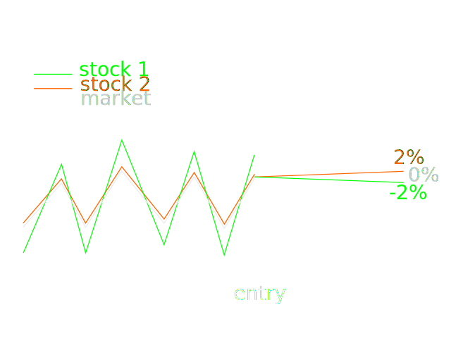
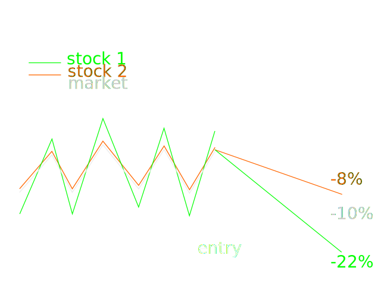
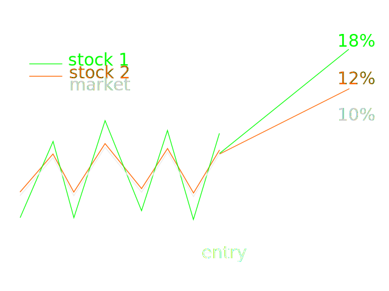

# Week 6: Event studies, Fundamental Law and CAPM

## Assessing an event study
[(watch section)](https://class.coursera.org/compinvesting1-003/lecture/view?lecture_id=121)

How to operationalise the results of an event study to actually trade?

In the previous lectures, we defined price events, but there are other events that could be interesting:

* events related to technical indicators: Bollinger bands, RSI 
* event on fundamental features
* e.g. only stocks that have a market cap of $1b, and they price drops 10%

*Bollinger Bands* are a volatility indicator consisting of two bands equal to a moving price average plus/minus several times the standard deviation.

The *Relative Strength Index* is an index that may hint whether an equity is being oversold or overbought: $$\text{RSI} = \frac{X}{X+1}$$ where X is the ratio of moving average up close prices over moving average down close prices $$X=\frac{\langle\text{up close price}\rangle}{\langle\text{down close prices}\rangle}$$. It's overbought when the RSI gets close to 0.7, and undervalued when close to 0.3.

So, the event profiler takes the event definition and generates events. The profiler can then generate a chart from them. You can also use those events to generate order in a market simulator. Homework 4 is about converting events into orders.

The purpose of the event study is to test hypothesis. You need to **compare a technical indicator for an equity to the equivalent indicator for the market**. There is information about something going on with alpha when they differ. For instance, when the market is in the high Bollinger band, and the equity's BB is low. It could be a buying opportunity! But to test that, you define an event and study it to interpret whether it's a useful event or not.

Once you have found in the vent study something that looks promising, you use the market simulator to operationalise it.

To operationalise an event, you need to determine 

* if it's a buy or sell, 
* how long to hold before exiting, and 
* how much money to allocate to the event.

What you look for is a very large number of opportunities, even with a small gain. It lowers the volatility, with good returns.

### How to assess the usefulness an Event Study

First, sanity check the chart. An event defined as a price increase on the day of the event should exactly show that on the chart.

Second, assess what the graph looks like. For instance, after an event that is a price drop, we search if the price climbs back up, and if so, how many days after the event the maximum happens, in average. Let's say that the top bounce back is at +10 days; that determines that the **maximum** time we want to hold the stock is 10 days. But we need to also take the **standard deviation** into account. If the stdev bands reveal that we can get a little smaller but more reliable gain after 5 days, it's maybe preferable. Remember, risk is to be mitigated.

### Homework 4
[(watch section)](https://class.coursera.org/compinvesting1-003/lecture/view?lecture_id=125)

Homework 4 puts together all the previous homework.

Definition of event is the base of all, the event study lets one experiment with various values and determine a good trading strategy. Once we have events, we can generate orders. 

Homework 4 is all about doing that: 

1. generating orders from events, 
2. running them from the market simulator from homework 3, and 
3. look at the report and assess if the event was operationalisable.

Specifically, in HW4:

Go in the event study code of HW3, and when you find an event, record to a file the trades that you would execute when the event occurs. 

Then, run these orders through the market simulator to get a performance.

How to operationalise an event study? Buy or sell? How long to hold?

When going through events, remember to issue the buy and sell orders at the same time, it is simpler. Later, sort them by date to ensure that they occur in the right order.

The homework page specifies an experiment using a $5 event. This example should be used on the forums to discuss implementation with others.

Imagine different sorts of events. It's not possible to include that in the quiz, but it's **important to imagine and test different sorts of events**.

Do it. Invent your own technical indicator and see if you can find good events.

#### Looking at the wiki instructions

In the event detection loop of HW3, when an event is detected, record both the entry and exit orders as `Date, BUY/SELL, SYMBOL, qty` in a file. This is the same format as what the market simulator accepts. 

To simplify the exercise, we assume that all orders are for 100 shares. In reality, the number of share would depend on their price, as we would allocate funds to an equity, rather than a number of shares. 

Chronologically order the orders list, feed it to the market simulator, assess the performance of the strategy using the total return and Sharpe ratio, from HW3.

##### Experiments

###### The control experiment, for everyone to discuss

Start with $50k, from 1 Jan 2008 to 31 Dec 2009, using _actual close_ $5-crossing events. Each time an event occur, buy $100 of that equity, that day, and sell 5 **trading** days later. 

The total return of the portfolio should be around 9% for that event.

###### Devise your own event, find something promising

It's not assessed, not discussed, but it;s important that you design your own events.

## The Fundamental Law
[(watch section)](https://class.coursera.org/compinvesting1-003/lecture/view?lecture_id=127)

Module objectives:

* understand the **information ratio** IR
* understand **information coefficient** IC
* understand **strategy breadth** BR
* understand the **fundamental law**
* learn why **lots of small bets** are better
* learn about example applications of the fundamental law.

The fundamental law of active portfolio management proposed by Grinold (see reference boom for the course) provides a framework to help make quantitative decisions. For instance: should we expand effort on improving forecast or on multiplying trading opportunities? The fundamental law helps decide that.

*Wide diversification is only required when the investors do not understand what they are doing. -- W. Buffet*

But it's also valid to approach investing by making a lot of little bets where, for each bet, you have few information. It's the opposite of Buffet's approach of making a few large bets with deep information about each bet.

### The coin flip thought experiment

Let's think about betting on the outcome of a coin flip being like making a trade. When we enter a position and exit a few days later, that's a bet. To make those bet effectively, we need to calculate their expected outcome.

We assume that the information that we have about the probabilities is encapsulated in a coin flip. The coin is biased, and we have evidence that it's a little more likely to come out as heads. p(heads) = 0.51

Out uncertainty about the outcome of the coin flip is a model of beta, and the coin bias is a representation of alpha. we have a 2% advantage in each coin flip.

When making a bet, we put a chip on the table, representing the amount we are betting. If we get a heads, we gain 100%, doubling out bet. If tail, we lose our chip entirely, -100%.

What is better, one $1000 bet, or 1000 bets with $1 tokens? The analogy is that on the trading floor, you might have info about 1000 stocks, and have to decide to invest a little in each, or to invest more in a few.

We consider the reward / risk ratio. The expectation (reward) is the same in both cases, $20:

If we make one $1000 bet, $$E(\text{gain}) = 0.51 \times 1000 + 0.49 \times -1000 = 20$$

If we make 1000 times a $1 bet, our expected return is 1000 time 2 pennies: $$E(\text{gain}) = 1000 (0.51 \times 1 + 0.49 \times -1) = 20$$

The risks are very different. 

The first risk measure is the **probability to lose everything**.

If we make one $1000 bet, $$p(\text{outcome}=-1000) = 0.49$$, it's a huge risk.

If we make 1000 times a $1 bet, $$p(\text{outcome}=-1000) = 0.49^ 1000$$, it's not very risky

The second measure of risk is the **standard deviation of returns**. The problem is that there is no meaningful standard deviation for one event such as out $1000 bet. So, we assimilate the $1000 bet to be followed by 999 bets of $0.

If we make one $1000 bet, $$\sigma(1000, 0, 0, 0, \ldots, 0) = 31.62$$. 

If we make 1000 $1 bet, $$\sigma(1, -1, 1, 1, -1, \ldots, -1) = 1$$, 

Using this second measure of risk, the reward/risk ratio is 0.63 for the single bet, and 20 for the 1000 bets.

So, the multiple bet case is better in many ways. For the same expected return, we get a lower risk to lose everything, a lower standard deviation, and as a result, a higher reward/risk ratio.

#### First contact with the law that links information to strategy breadth

The Sharpe ratio or the reward/risk ratio for the multi-bet case is equal to that of the single bet case times the square root of the number of bets in the multi-bet case. 

$$
\text{Sharpe}_\text{multiple bets} = C \alpha \sqrt{n_\text{bets}}
$$

in our case, $$ \text{Sharpe}_\text{1000 coin flip bets} = \text{Sharpe}_\text{single coin flip bet} \sqrt{1000} = 0.63 \times 31.62 = 20 $$

Where $$\alpha$$ is what we know about the bias, the 2% chance that the coin is likely to come up heads and C is a constant coefficient.

It means that:

* if you improve alpha, you improve the reward/risk ratio. Make the coin more biased, or, in investing, make better forecasts about individual stocks.
* if you make more bets (improve the *breadth* of your strategy), you improve your reward risk ratio, but slower, through a square root function. So, to double the benefit of the breadth, you have to quadruple the breadth.

Often, methods to make more bets, so to find more opportunities, leads to lower alpha. It's a balance. 

Thiking back about the Buffet quote that *wide diversification is only required when the investors do not understand what they are doing,* we now understand that it means that a large breadth is only necessary for investors with low alpha.

### The fundamental law of active portfolio management
[(watch section)](https://class.coursera.org/compinvesting1-003/lecture/view?lecture_id=129)

See Active Portfolio Management Chapters 5 and 6 (Grinold & Kahn 1999).

Let's look at that law in the context of well-known portfolio managers: Warren Buffet, Jim Simons, Steve Cohen.

Buffet and Simons offer about the same performance. Well, Simons' company performs better, but let's assume that they are similar.

Buffet has very few companies in his portfolio. He thinks carefully about each investment.

Simons is the best computationally quantitative investor. His company, Renaissance Technologies, makes at least hundreds of thousands of small trades everyday. 

We can compare these two approaches in the context of the fundamental law.

Let's look again at the CAPM:

$$
r_p(t) = \beta_p r_m(t) + \alpha_p(t)
$$

where the portfolio return $$r_p(t)$$ is the compound of the return due to the market $$\beta_p r_m(t)$$ and of the *residual return $$\alpha_p(t)$$*. Alpha, the residual return, is usually considered to be the contribution of the portfolio manager.

The standard deviation of each component contributes to risk. The standard deviation of the market return represents the *market risk*, due to market volatility. The standard deviation of the alpha component is the inherent risk of the portfolio manager's strategy or lack of it. 

The *standard deviation of the residual return* (alpha component) is called *residual risk*.

The *mean of the residual return* is the *return due to skill*.

Grinold's *information ratio* IR is the return due to skill divided by the redial risk: $$IR = \frac{\text{mean}(\alpha_p(t))}{\text{stdev}(\alpha_p(t))}$$. This IR is also defined as *forecasting performance times root of strategy breadth*, as we will see below.

The *information coefficient* IC represents the forecasting skill of a manager. It is the *correlation between the forecast and the actual return*. In the biased coin example, with all the information we have (51% probability of heads), we have to always assume that it comes up heads, so our IC is the correlation between a series of 1 and a series of 51% or 1 and 49% of 0. If we could have extra info at the last moment telling us what the outcome will be, then we could take advantage of it and have a perfect information coefficient. In terms of investing, the IC related to how good we are at predicting a future stock price.

The *breadth* BR  of a strategy is the number of opportunities to execute it. In the coin flip example, it's the number of coin flip bets. In inviting, it's the occurrence frequency of the event.

With that, we can write the fundamental law:

> **The fundamental law:** The information ratio equals the info coefficient times the square root of the strategy breadth.
> 
> $$\text{IR} = \text{IC}\sqrt{\text{BR}}$$

So, the fundamental law makes the balance between strategy specificity and strategy breadth explicit: the more specific and predictive, the less breadth, reducing the IR by the square root of the reduction in breadth, but increasing it linearly with prediction performance (IC, skill).

#### Some concrete examples of using the fundamental law
[(watch section)](https://class.coursera.org/compinvesting1-003/lecture/view?lecture_id=131)

Let's compare the trading approaches of Buffet and Simons. RenTec has outperformed Buffet in the last few years, but in this example, we assume that it's not the case.

*We believe that according the name 'investors' to institutions that trade actively is like calling someone who repeatedly engages in one-night stands a 'romantic' -- W. Buffet*

This quote criticises portfolio management, in particular HFT. Indeed, strategies like those at Renaissance Tech or SAC Capitals are not so much about investing (betting on companies) as about betting on price movements. Buffets investigates companies deeply, buys and holds for very long periods. While Buffet holds stock in a company, he monitors it closely and actively takes part in the company life, replacing the CEO, give instructions to the companies, etc. Buffet actively manages the companies in which he invests.

Buffet has great brainpower, but he only has one brain. He only can deeply analyse a handful of companies. He is unable to look at all 13k equities in North America. Buffet doesn't scale.

Computational methods scale. If a program defines a predictive measure, it can look at all 13k North American equities quite easily.

Buffet's portfolio: small breadth because small number of equities, holding for very long. Very large alpha.

Simons' portfolio: very large breadth because large number of bets everyday. Much lower alpha.

Let's use the law of active portfolio management $$\text{IR} = \text{IC}\sqrt{\text{BR}}$$ to compare some made-up numbers about Buffet and Simons.

##### Solving of Buffet's skill

We assume that Buffet's Sharpe ratio is 3, and that he makes 120 trades per year. 

We can use the Fundamental law to quantify Buffet's skill.

$$
\begin{align}
\text{IR} &= \text{IC}\sqrt{\text{BR}}\\\\
3 &= \text{IC}\sqrt{120}\\\\
IC &= 0.27
\end{align}
$$ 

##### RenTec

We assume that Renaissance Technologies is 100 times less skilled than Buffet. RenTec skill is then 0.0027. 

How many trades does RenTec need to make to achieve Buffet's reward/risk ratio of 3.0?

$$
\begin{align}
\text{IR} &= \text{IC}\sqrt{\text{BR}}\\\\
3 &= 0.0027 \sqrt{BR}\\\\
BR &= 1234567 
\end{align}
$$ 

If Renaissance Technologies is 100 times less skilled than Buffet, they need to make 10000 times more trades than Buffet.

$$\to$$ If you have lower skill, but you can scale it, you can reach the same performance levels as Buffet. The key is to be able to scale and make lots of little bets.

> There are two ways to succeed (and you should work on both). One is to improve your skill. The other is to improve your breadth. But remember, the Sharpe ration only increases as the square root of the breadth. 

## The CAPM for portfolios
[(watch section)](https://class.coursera.org/compinvesting1-003/lecture/view?lecture_id=117)

Goal of the module:

* Review the CAPM
* Extend CAPM from individual assets to portfolios
* Understand portfolio beta and alpha
* How to use the CAPM to reduce market risk

Besides, the CAPM is important for machine learning. It's good to read the reference book, Ch 5 and 6.

### CAPM recap and overview for portfolios

The CAPM:

$$
r_i(t) = \beta_i r_m(t) + \alpha_i
$$

where $$r_i(t)$$ is the equity's expected return, the beta of that equity to the market times the return on the market $$\beta_i r_m(t)$$ is the return that we expect on our equity because of its association with the market, and $$\alpha_i$$ is the return that is specific to the stock.

This $$\alpha_i$$ is further conceptualised as the sum of  $$\alpha(t)$$, a forecasted component, and  $$\epsilon(t)$$, a random noise component. Of course, $$\epsilon$$ is not intrinsic noise, it's just the part of a stock's performance that we don't model. 

#### Extending the CAPM to portfolios

Let $$h_i$$ the share of the portfolio in equity $$i$$. 

The equation that gives the return of the whole portfolio is just a weighted sum: $$r_p(t) = \sum_i h_i r_i(t)$$, where $$r_i(t) = \beta_i r_m(t) + \alpha_i$$ as per the CAPM.

##### Example

2 assets: asset one with a beta of 3 to the market is 25% of the value of the portfolio, and asset two with a beta of 1, is 75% of the portfolio.

$$
\begin{cases}
h_1 = 0.25\\\\
h_2 = 0.75\\\\
\beta_1 = 3\\\\
\beta_2 = 1\\\\
\end{cases} 
$$

$$
\begin{align}
r_p(t) &= \sum_i h_i r_i(t)\\\\
&= h_1 (\beta_1 r_m(t) + \alpha_1) + h_2 (\beta_2 r_m(t) + \alpha_2)\\\\
&= h_1 \beta_1 r_m(t) +  h_2 \beta_2 r_m(t) + h_1 \alpha_1 + h_2 \alpha_2\\\\
&= \text{return due to market} + \text{return due to "skill"}\\\\
&= 1.5 r_m + .25\alpha_1 + .75\alpha_2
\end{align}
$$

The overall portfolio has a beta of 1.5 to the market, and one alpha component per equity. We can control these individual alpha components, and we want to use them to both reduce the exposure to the uncontrollable beta component, and make profit. 

### Using CAPM to reduce market risk in a portfolio
[(watch section)](https://class.coursera.org/compinvesting1-003/lecture/view?lecture_id=119)

The CAPM can be used to reduce market risk from a portfolio.

Consider a situation where a portfolio has two stocks:

Stock 1 is forecasted to go down (relative to the market. it's always relative to the market.). So we want to short it. We also know that $$\beta_1=2$$, which means that when the market moves by 1%, stock 1 moves by 2%.

Stock 2 is forecasted to go up, so we want to long it. $$\beta_2=1$$.

#### Plan: -50% stock 1, +50% stock 2

Stock 2 tracks the market closely. Stock 1 varies twice as much as the market. Let's assume that the market is flat, has no overall return. that means that the beta of the portfolio will have no influence, the market return will be 0, and all returns of the portfolio will be thanks to alpha.

##### If stocks perform as expected and the market is flat.

* stock 1, which we shorted, goes down 2%, so we made 2% return
* stock 2 goes up 2%, and we also make 2%.
* Overall, we made 2%.

##### If stocks perform as expected and the market goes down 10%

* stock 1, which we shorted, goes down by its alpha of 2% plus its beta (2) times the market (-10%), going down for a total of 22%, so we made 22% return on stock 1
* stock 2 goes up 2% plus its beta of 1 times the market return or -10%, totalling 8% loss, so we lose 8%. 
* Overall, our portfolio makes $$\frac{22\%-8\%}{2} = 7\%$$.

##### If stocks perform as expected and the market goes up 10%

* stock 1, which we shorted, goes down by its alpha of 2% but up by its beta (2) times the market (10%), going up for a total of 18%, so we lost 18% on stock 1
* stock 2 goes up 2% plus its beta of 1 times the market return or 10%, totalling 12% return, so we gain 12%. 
* Overall, our portfolio makes $$\frac{-18\%+12\%}{2} = -3\%$$.

But we predicted the stocks' alphas correctly! We shouldn't lose! We have skillzz!1!

The **mistake was to short a high beta stock without hedging against a positive market return**. The market overwhelmed our "skill".

To avoid that this happens, we can to take advantage of the CAPM: in $$r_p(t) = \beta_p r_m(t) + \alpha_p(t)$$, we want to do is eliminate the return due to the market $$\beta_p r_m(t)$$, thereby eliminating the market risk.

To do that, we find holding $$h_i$$ that cancel the portfolio's beta.

#### Plan: -33% stock 1, +66% stock 2

As $$\beta_1 = 2$$ and $$\beta_2 = 1$$, the $$h_1=-33\%$$ and $$h_2=66\%$$ allocation will result in a portfolio beta of $$\beta_p = -0.33\times 2 + 0.66\times 1 = 0$$

As a result, the market component is now 0 in our portfolio return equation: $$r_p(t) = 0 + -0.33\alpha_1 + 0.66\alpha_2$$

##### If stocks perform as expected and the market goes up 10%

* stock 1, which we shorted, goes down by its alpha of 2% but up by its beta (2) times the market (10%), going up for a total of 18%, so we lost 18% on stock 1, but now with an $$\alpha_1 = \dfrac{1}{2}\alpha_2$$
* stock 2 goes up 2% plus its beta of 1 times the market return or 10%, totalling 12% return, so we gain 12% but with with a larger alpha 
* Overall, our portfolio makes $$-18\%\times 0.33+12\%\times 0.66 = 1.98\%$$.
