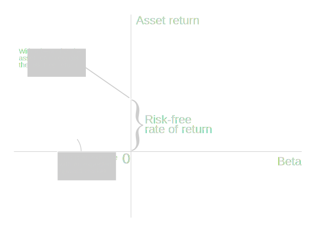
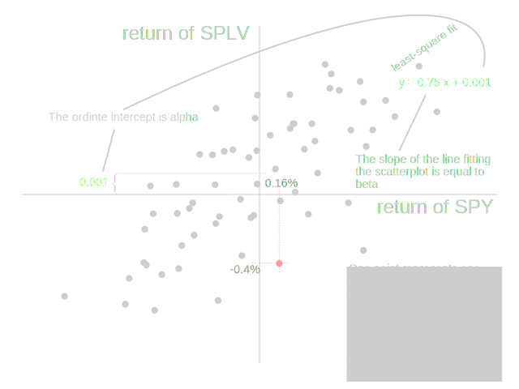

# Week 8: Finale

## Jensen's alpha
[(watch section)](https://class.coursera.org/compinvesting1-003/lecture/view?lecture_id=191)

*Jensen's alpha* is a measure of the performance of mutual fund managers developed in 1968 by Michael Jensen. It addresses the problem of assessing the performance of investments in high beta stocks. Such stocks can have good return merely thanks to market volatility.

### The market component of the CAPM with risk-free returns

We can express the market component of the CAPM as:

The expected return on investment \\(E(R\_i)\\) equals the risk-free rate of return \\(R\_f\\) plus the beta of the asset \\(\beta\_i\\) times the expected market return minus the risk-free rate \\((E(R\_m) - R\_f)\\).

\\[ E(R\_i) = R\_f + \beta\_i (E(R\_m) - R\_f) \\]

The risk-free rate is currently very close to 0, but if interests rate climb up again, the risk-free rate may become significant again.

### CAPM vs actual returns

The equation \\( E(R\_i) = R\_f + \beta\_i (E(R\_m) - R\_f) \\) doesn't exactly add up : when comparing an equity's return to the market

For instance, comparing SPLV to the S&P 500 in 2013 to date: although the symbol has a beta of 0.75, it outperforms the market. The return should not be as high as the market, but it's higher.

That difference is alpha.

### The Full CAPM with alpha

\\[ E(R\_i) = R\_f + \beta\_i (E(R\_m) - R\_f) + E(\alpha) \\]

The CAPM asserts that \\(E(\alpha) = 0\\).

However, investors believe that \\(E(\alpha) > 0\\) and represents the skill of the investor.

When plotting the daily returns of SPLV (minus risk-free rate) against the market (minus risk-free rate too), we can obtain an estimate of beta and of alpha: 

That intercept is essentially Jensen's alpha.

## Back-testing
[(watch section)](https://class.coursera.org/compinvesting1-003/lecture/view?lecture_id=193)

*Forward testing* is the process of testing a strategy on the current market by recording hypothetical trades that we *would do*. This allows validating the strategy in real-time. the first problem with that is that it takes some time before acing enough data to draw conclusions. Back-testing doesn't have this drawback.

*Back testing* is the process of testing a trading strategy on prior time periods by simulating the trades on historical data. After rolling back to an earlier point in time, you progress while only presenting the strategy with immediate and past information, without any direct or indirect peeking in the future. The back-testing system

* takes orders from the strategy
* simulate the execution of those orders
* keeps track of the portfolio value

This done, the portfolio value history can be assessed using the tools we learnt in the earlier lectures.

### Risks of back-testing

Back testing presents risks, you shouldn't believe in the results it presents, because

* you are biased, and are selecting strategies knowing what would have worked in hindsight. Even if the strategy doesn't have access for the future, you, when you designed the strategy, had this information.
* the market is probably different now than then. For instance, back-testing during the dot-com boom of the late 90s, you will find that high-growth stocks are good investments. Implementing that in 2013 may not work.
* the data mining fallacy: the strategy may work on past data by sheer luck. Optimising parameters to fit the back-tested data may lead to over-fitting it. The strategy is optimised to noise, not to an underlying principle.

To reduce these risks, you can 

* cross-validate: do the initial testing on a subset of the data, and test with the remaining data. ex: develop strategy with stocks A-M, test it on N-Z. Splitting by time may still lead to over-fitting; there is a lot of similarity between two adjacent periods.
* a better way to prevent over-fitting is to learn over an historical period of time AND a limited set of stocks, and test over the larger set of stocks, then over the later period. It should work in each of those settings.

### Components of a back-tester

The previous homework have led to the creation of a partial back-testing program: a market simulator, and some code to generate trades.

We left out many things. The components of a back-tester are

* **data**, fed to the strategy
* a **definition of the strategy** that generates orders from data
* a **market simulator** that executes orders
* an **analysis engine** that can quantitatively assess the performance of the strategy

The data must be complete, survivor-bias free. A strategy that is back-tested on survivor biased data is misleading, you'd think it always picks good stocks.

The strategy definition can be code, or with some tools, some graphical thing. If it's code, it'd better be all in one place.

The market simulator needs to consider **transaction costs** and **market impact**, 

The analysis engine should look at things like correlation with major indices, tell all about the performance, etc.

#### Example: market impact simulation

A strategy that may discover that you can make money on *thinly traded stocks* (stocks that don't have a lot of volume). The system may generate orders that are out of range with the depth of the order book, like "Buy $100m of SYMBOL", where SYMBOL is a $5m company...

That strategy could not be executed. 

In the simulator:

* Make sure that on the day of the order, there is enough volume to fulfil the order
* Even if there is enough volume, the order may adversely affect the price, hence you need to simulate the impact of your order on the price of the entity.

A [paper](http://www.courant.nyu.edu/~almgren/papers/costestim.pdf) by Almgren et al (*Almgren, Robert, et al. "Direct estimation of equity market impact." Risk 57 (2005).*) estimates the market impact in function of how much of the volume the order is consuming.

This type of study can be used to improve the realism of the market simulator.

#### Example of analysis system

Output of the analysis system of Lucena (dr Balch's company)

* parameters of the back-test
* chart with benchmark and fund performance
* Sharpe for both, 
* risk/return plot with pith points (X=stdev, Y=avg daily return)
* exposure and leverage
* correlation with major indices
* Beta with regard to major indices (where you consider the index as a representation of the market)
* performance by year and month
* more

## Machine learning
[(watch section)](https://class.coursera.org/compinvesting1-003/lecture/view?lecture_id=197)

There are >13000 securities in North America, 120 technical and fundamental factors, 252 trading days per year.

That makes ~2 billion data points in 5 years.

Machine learning can help. It's the construction of systems that can learnt from data. It can do classification or for regression. Regression is about numerical prediction. 

We want to **build a model from data**. The model then takes an input X (observation), maybe some features of a stock, and outputs a forecast Y (prediction of future price). 

### Parametric model

Example: model of rain amount in function of change in barometric pressure. One data point contains <change in pressure that day, amount of rain that day>

We can model that using a linear function, the parametric model has only 2 parameters: \\(\text{rain} = m \times \text{pressure} + b\\).

A second-order polynomial requires learning 3 parameters, etc... 

With such a polynomial model, the *queries* (predictions) are made by applying the polynomial to the data.

#### advantages of parametric models

They don't overfit the data, tending to generalise well.

They are fast at run-time.

#### disadvantages of parametric models

Non-linear or non-polynomial models are hard to fit.

### "Data-driven" (non-parametric) models

The queries for a data-driven *K-nearest-neighbours model* are made by searching for the K closest points in range to the query (\\(KNN(X) \, \to \, Y\_\text{hist}\\), for instance). Then, apply a function to these points, for instance, take their average: \\(\text{forecast} = \langle{Y\_\text{hist}\rangle\\).

With this data-drive model, it fits the data at every point. It doesn't impose a parametric model.

#### advantages of data-driven models

Can model complex data well.

Easy to add or remove data. There is no learning

#### disadvantages of data-driven models

Slower at run-time, requires sorting, distance calculation.

They are susceptible to overfitting. 

### Extending to more dimentions

If we add more components to out model. The queries become two-dimensional. In the weather example, the query could be based on the barometric pressure and ambient humidity.

### Application to trading and investing

Instead of trying to predict rainfall from barometric pressure and humidity, let's try to predict future equity price from, say, P/E ratio and news.

Questions:

* What are the best factors to use? Should we use machine learning to find the best features, or human insight?
* What data to use? 
* How to assess if a model is good? How to measure its predictive value?
* How to prevent overfitting?
